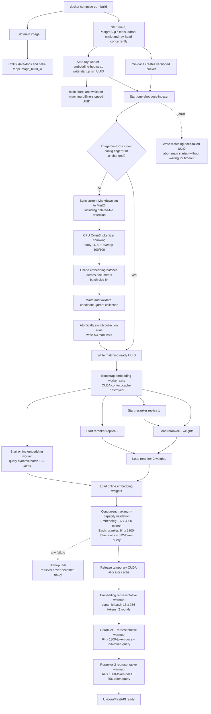
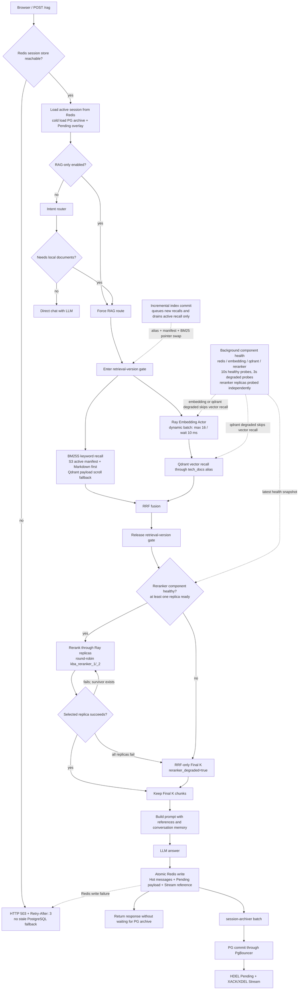
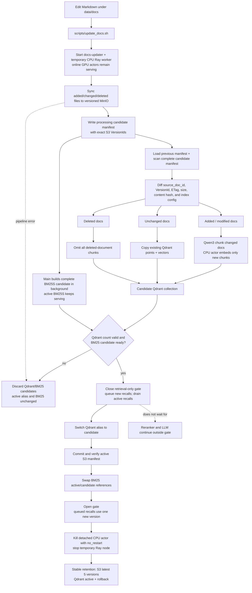

# Knowledge Base Assistant

中文文档见 [readme.zh.md](readme.zh.md).

Knowledge Base Assistant is a general-purpose chat application for exploring a
replaceable local Markdown knowledge base. It uses intent routing to choose
between retrieval-augmented answers grounded in the indexed corpus and direct
chat for requests that do not need retrieval.

Qdrant provides vector search, a local BM25 index provides keyword recall,
Redis serves active chat sessions while PostgreSQL archives complete history,
SentenceTransformers generates embeddings, and FastAPI serves both the API and
browser UI. Generation is provider-configurable: the default setup targets an
OpenAI-compatible cloud API, Anthropic is supported, and a local vLLM service
remains available as an optional Docker Compose profile.

The repository currently ships with 102 long-form contract documents from the
RAGBench `cuad` test split under `data/docs/RAGBench/`. The corresponding source
records and 500 labeled queries live under `RAGBench_Eval/`. Retrieval benchmark
requests should enable `RAG-only` so intent-routing accuracy is measured
separately from document recall.

## Highlights

- Docker Compose deployment for Redis, PostgreSQL, PgBouncer, Qdrant, local
  MinIO S3 storage, Ray model workers, and FastAPI.
- Configurable cloud LLM providers with an optional local vLLM profile.
- Jina embeddings v5 text small by default, with task/prompt routing for
  retrieval-query, retrieval-passage, and classification embeddings.
- Replaceable Markdown corpus with a `RAG-only` benchmark mode that separates
  retrieval evaluation from application-specific intent hints.
- Chat-style web UI at `/` with adjustable BM25, cosine, RRF, and final context
  counts.
- Required account login with Redis-hot, PostgreSQL-archived sessions per user
  and an admin UI for user/data management.
- Admin CSV import for batch user creation with strict `email,passwd` format
  validation.
- Intent routing avoids vector search for clear direct-chat questions.
- Source references are shown when retrieval is used.
- Conversation history is stored server-side and compacted only when estimated
  prompt pressure approaches the active LLM context window.
- Runtime configuration is environment-driven through `.env`.
- The startup superuser can update the LLM provider, base URL, model, API key,
  and context-window size from the Admin UI without rebuilding containers.
- Supports Hugging Face cache volumes, local model directories, mirrors, and
  host-side HTTP proxy settings for restricted networks.
- Code Search for local source folders: CodeBERT file/function embeddings,
  AST-based Python/C++ symbol extraction, and static call graphs.

## Architecture

```text
Browser UI
   |
FastAPI /auth, /sessions, /rag
   |-- Redis active sessions + pending archive stream
   |-- PostgreSQL users, settings, and complete session archive
   |
IntentRouter
   |-- keyword rules and previous-route strong follow-up state
   |-- Jina classification similarity over single-intent anchors
   |-- configured LLM fallback with previous route state
   |
RAGPipeline or Direct Chat
   |-- BM25 keyword recall + Qdrant vector recall -> RRF fusion
   |-- optional Jina cross-encoder reranking
   |-- OpenAI-compatible or Anthropic LLM API
   |
Answer + retrieved references + compacted conversation memory
```

Main modules:

- `app/main.py`: FastAPI routes, health check, and static UI serving.
- `app/static/`: browser chat UI — `index.html` shell, `css/styles.css`, and
  ES modules under `js/` (`store`, `api`, `dom`, `markdown`, and `views/`).
  Served directly by FastAPI with no build step.
- `app/session_store.py`: PostgreSQL-backed users, login tokens, chat sessions,
  messages, runtime LLM settings, route metadata, and compacted conversation
  summaries.
- `app/redis_session_store.py`: active-session cache, auth-token cache, pending
  overlays, atomic archive-stream writes, consistent cold loading, and strict
  HTTP 503 responses when Redis session state is unavailable.
- `app/session_archive.py`: independent Redis Stream consumer that archives
  exchanges to PostgreSQL idempotently before acknowledging and clearing them.
- `app/intent_router.py`: keyword/state, Jina-classification embedding, and
  tagged LLM fallback routing.
- `app/rag.py`: hybrid recall, RRF fusion, reranking, prompt construction, and
  context-budget-aware history compaction.
- `app/reranker.py`: Jina cross-encoder reranking for recalled chunks, using
  Ray actors when enabled.
- `app/vector_store.py`: Markdown chunking, Jina embeddings v5 task routing,
  BM25 indexing, Qdrant collection management, vector search, and RRF fusion.
- `app/code_indexer.py`: tree-sitter based Python/C++ source parsing, CodeBERT
  embeddings, Qdrant indexing, and PostgreSQL persistence for code files and
  functions.
- `app/code_retrieval.py`: CodeBERT-first source retrieval over files and
  functions, repo-wide function recall, lexical candidate expansion, and
  explicit text-only degradation reporting.
- `app/call_graph.py`: tree-sitter based call extraction and networkx directed
  call graph queries.
- `app/llm_client.py`: provider-aware client for cloud APIs or local vLLM.
- `scripts/`: manual service, ingest, retrieval smoke-test, and intent-router
  A/B evaluation commands.
- `data/docs/`: replaceable Markdown documents ingested into Qdrant.
- `data/eval/`: labeled intent-routing cases, including bilingual slices.

## Repository Contents

This repository is intended to be pushed without local runtime state. The
committed project should include:

- Source code under `app/`, `scripts/`, and `docker/`.
- Deployment files: `Dockerfile`, `compose.yaml`, `compose.cpu.yaml`,
  `.env.example`, and dependency files.
- Markdown corpus files under `data/docs/` and labeled routing evaluation
  cases under `data/eval/`.
- Contributor/project docs such as `readme.md` and `AGENTS.md`.

The repository should not include `.env`, model weights, Hugging Face caches,
PostgreSQL data, Qdrant storage, logs, virtual environments, or local editor
files. These are covered by `.gitignore`.

## Quick Start With Docker Compose

Prerequisites:

- Docker with Compose v2.
- A cloud LLM API key for the default cloud-backed setup.
- Optional: a compatible NVIDIA GPU, current NVIDIA driver, and NVIDIA
  Container Toolkit if you want Docker containers to use CUDA. Very old GPUs
  may not support the PyTorch/Transformers CUDA build used by the embedding
  model, reranker, or local vLLM profile.

Create local settings:

```bash
cp .env.example .env
```

Set `LLM_API_KEY` and, if needed, `LLM_MODEL` in `.env`. Account login is
always required and chat sessions are persisted per user in PostgreSQL. The
default administrator is created on startup:

```text
username: admin
password: 123456
```

Change `AUTH_DEFAULT_ADMIN_PASSWORD` before exposing the deployment beyond
local development. If the PostgreSQL volume already contains an `admin` user,
startup keeps that user's existing password. PostgreSQL runs inside Docker
Compose; you do not need to install PostgreSQL on the host.

Start Redis, the session archiver, PostgreSQL, PgBouncer, Qdrant, MinIO-backed
S3 storage, and the API:

```bash
docker compose up --build
```

Open the app:

```text
http://localhost:8080
```

For the local S3 console, open:

```text
http://localhost:9001
```

Default MinIO credentials are `minioadmin` / `minioadmin`; change them before
using the stack outside a local demo.

Use a different host port:

```bash
APP_PORT=9000 docker compose up --build
```

Then open `http://localhost:9000`.

After changing `.env` values, recreate the containers so the API sees the new
environment:

```bash
docker compose up -d --build --force-recreate
```

Stop services:

```bash
docker compose down
```

Reset persisted Redis, PostgreSQL, Qdrant, MinIO, and Hugging Face cache volumes:

```bash
docker compose down -v
```

## Startup Behavior

`compose.yaml` starts twelve long-running services plus three ordered startup
services by default:

- `postgres`: runs PostgreSQL inside Docker and stores users, login tokens, and
  chat sessions in the `postgres_data` Docker volume.
- `pgbouncer`: provides transaction-mode connection pooling between `main` and
  PostgreSQL, accepting short-lived application connections while reusing a
  bounded set of PostgreSQL server connections.
- `redis`: serves active chat sessions from a 32 GB `volatile-lru` cache and
  persists non-evictable pending/archive data with AOF `everysec`.
- `session-archiver`: independently consumes Redis archive events, commits
  idempotent batches through PgBouncer, then clears Pending and Stream entries.
- `qdrant`: stores vectors in the `qdrant_storage` Docker volume.
- `minio`: provides local S3-compatible object storage in the `minio_data`
  Docker volume.
- `minio-init`: creates the configured document bucket and enables S3 object
  versioning.
- `ray-head`: owns the Ray cluster control plane and Ray client endpoint.
- `ray-worker-embedding-bootstrap`: temporary GPU worker used only for offline
  document embedding through the dedicated `kba_embedding_bootstrap` actor.
  The indexer explicitly destroys that detached actor before the worker exits,
  releasing its CUDA context and retained allocator cache.
- `docs-indexer`: one-shot CPU chunker and index coordinator. It syncs Markdown
  into MinIO, creates 64-chunk cross-document embedding batches through Ray,
  validates the candidate Qdrant collection, and atomically switches the alias.
- `ray-worker-embedding-ingest-cpu` and `docs-updater`: on-demand services under
  the `docs-update` profile. They build an incremental candidate with a unique
  CPU-only Ray embedding actor while the online GPU actors continue serving.
- `ray-worker-embedding-1`: runs the named document embedding actor, performs
  bounded online query micro-batching (`16` requests / `10ms`), and starts only
  after the bootstrap embedding worker has exited.
- `ray-worker-reranker-1` and `ray-worker-reranker-2`: run two reranker actor
  replicas. They start in parallel with the online embedding worker after
  offline indexing releases the GPU.
- `autoheal`: watches Docker healthchecks and restarts services that are safe
  to heal as a single container, such as `redis`, `session-archiver`,
  `pgbouncer`, `qdrant`, and `main`.
- `main`: starts alongside the infrastructure but holds Uvicorn behind the
  current startup-run marker and the online model readiness barrier. It serves
  FastAPI only after the document index is committed, the online model workers
  are released, maximum concurrent GPU capacity is validated, and
  representative caches are warmed.

Docker service architecture:

```mermaid
flowchart TD
    User["Browser / curl<br/>localhost:8080"] --> Main["main<br/>FastAPI + UI + RAG orchestration<br/>Ray client only"]

    subgraph Compose["Docker Compose network"]
        Main
        PG["postgres<br/>PostgreSQL<br/>users / sessions / messages / settings"]
        PgBouncer["pgbouncer<br/>transaction connection pool<br/>reuses PostgreSQL server connections"]
        Redis["redis<br/>32 GB volatile-lru hot sessions<br/>AOF everysec + non-evictable Pending/Stream"]
        Archiver["session-archiver<br/>Redis consumer group<br/>idempotent PG batch archive"]
        Qdrant["qdrant<br/>Qdrant<br/>vector collections + aliases"]
        MinIO["minio<br/>S3-compatible object store<br/>versioned docs"]
        MinIOInit["minio-init<br/>one-shot bucket init<br/>enable versioning"]
        RayHead["ray-head<br/>Ray control plane<br/>ray://ray-head:10001"]
        BootstrapEmbed["ray-worker-embedding-bootstrap<br/>temporary offline GPU worker<br/>embedding batch: 64"]
        DocsIndexer["docs-indexer<br/>one-shot Qwen3 chunker<br/>S3 sync + candidate index + alias switch"]
        CpuIngest["ray-worker-embedding-ingest-cpu<br/>docs-update profile<br/>CPU-only Ray worker"]
        DocsUpdater["docs-updater<br/>docs-update profile<br/>manifest diff + candidate coordinator"]
        EmbedWorker["ray-worker-embedding-1<br/>Ray worker: ray_worker_embedding<br/>kba_embedding actor<br/>query batch: max 16 / wait 10 ms"]
        RerankWorker1["ray-worker-reranker-1<br/>Ray worker<br/>resource: ray_worker_reranker_1<br/>hosts kba_reranker_1 actor"]
        RerankWorker2["ray-worker-reranker-2<br/>Ray worker<br/>resource: ray_worker_reranker_2<br/>hosts kba_reranker_2 actor"]
        BM25Manager["main BM25S manager<br/>active + candidate indexes<br/>atomic reference swap"]
        HealthSupervisor["main health supervisor<br/>redis / embedding / qdrant / reranker<br/>independent lightweight probes"]
        Autoheal["autoheal<br/>Docker healthcheck watcher<br/>restarts unhealthy containers"]
        VLLM["vllm<br/>optional local-llm profile<br/>OpenAI-compatible LLM server"]
    end

    Main --> Redis
    Main --> PgBouncer
    Redis --> Archiver
    Archiver --> PgBouncer
    PgBouncer --> PG
    Main --> Qdrant
    Main --> MinIO
    Main --> RayHead
    Main --> BM25Manager
    MinIOInit --> MinIO
    MinIOInit --> DocsIndexer
    RayHead --> BootstrapEmbed
    DocsIndexer --> MinIO
    DocsIndexer --> BootstrapEmbed
    DocsIndexer --> Qdrant
    DocsIndexer --> StartupState["startup_state<br/>docs-ready / docs-failed / offline-stopped UUID"]
    StartupState --> Main
    StartupState --> BootstrapEmbed
    BootstrapEmbed -- "exit: release CUDA cache" --> EmbedWorker
    BootstrapEmbed -- "exit: release GPU" --> RerankWorker1
    BootstrapEmbed -- "exit: release GPU" --> RerankWorker2
    RayHead --> EmbedWorker
    RayHead --> RerankWorker1
    RayHead --> RerankWorker2
    RayHead -. "docs-update profile" .-> CpuIngest
    DocsUpdater -. "docs-update profile" .-> CpuIngest
    DocsUpdater -. "sync + version manifests" .-> MinIO
    DocsUpdater -. "candidate vectors" .-> Qdrant
    DocsUpdater -. "prepare / commit" .-> Main
    DocsUpdater -. "run-scoped ready / failed" .-> StartupState
    Main --> HealthSupervisor
    HealthSupervisor -. "collection / alias metadata" .-> Qdrant
    HealthSupervisor -. "PING" .-> Redis
    HealthSupervisor -. "embedding actor readiness" .-> EmbedWorker
    HealthSupervisor -. "parallel reranker readiness<br/>any replica healthy" .-> RerankWorker1
    HealthSupervisor -. "parallel reranker readiness<br/>any replica healthy" .-> RerankWorker2
    Autoheal -. healthcheck .-> Main
    Autoheal -. healthcheck .-> Redis
    Autoheal -. healthcheck .-> Archiver
    Autoheal -. healthcheck .-> PgBouncer
    Autoheal -. healthcheck .-> Qdrant
    Main -. optional .-> VLLM
    Main --> CloudLLM["Cloud LLM API<br/>OpenAI-compatible / Anthropic"]

    subgraph Volumes["Docker volumes and bind mounts"]
        PGVol["postgres_data"]
        RedisVol["redis_data<br/>AOF"]
        QVol["qdrant_storage"]
        S3Vol["minio_data"]
        HFVol["huggingface_cache"]
        StartupVol["startup_state<br/>per-run handoff"]
        DataBind["./data:/app/data:ro"]
        ModelsBind["./models:/models:ro"]
    end

    PG --> PGVol
    Redis --> RedisVol
    Qdrant --> QVol
    MinIO --> S3Vol
    Main --> DataBind
    Main --> HFVol
    Main --> StartupVol
    Main --> ModelsBind
    EmbedWorker --> HFVol
    EmbedWorker --> ModelsBind
    DocsIndexer --> DataBind
    DocsIndexer --> HFVol
    DocsIndexer --> StartupVol
    BootstrapEmbed --> HFVol
    BootstrapEmbed --> StartupVol
    RerankWorker1 --> HFVol
    RerankWorker1 --> ModelsBind
    RerankWorker2 --> HFVol
    RerankWorker2 --> ModelsBind
    CpuIngest --> HFVol
    CpuIngest --> ModelsBind
    CpuIngest --> StartupVol
    DocsUpdater --> DataBind
    DocsUpdater --> HFVol
    DocsUpdater --> StartupVol
```



Two-phase startup and image/config-bound document initialization:



The capacity phase deliberately submits all three maximum workloads before
waiting for any result. This validates the real cross-request peak in which
query embedding and both reranker replicas overlap on the same physical GPU.
Each actor reports allocated, reserved, and peak CUDA memory. Temporary
capacity-test cache is released, then performance warmup runs serially and
retains only the representative runtime cache. The reranker performance shape
uses the full 1,800-token assembled chunk maximum for all 64 RRF candidates and
a 256-token query. FastAPI lifespan does not complete if loading, capacity
validation, or representative warmup fails.

Plain `docker compose restart` does not rescan local Markdown. A new image build
id or changed index-config fingerprint makes `docs-indexer` sync and run the
manifest diff; it rebuilds only when the corpus or index configuration changed.
The image copies `data/docs`, so changing the corpus invalidates the build layer
and produces a new build id. A same-image Compose restart checks only the S3
marker and does not sync or diff local Markdown. Because BM25S is process-local
memory, restarting `main` reconstructs only the active BM25S index from the
already committed S3 manifest; it does not embed documents, create a collection,
or move the Qdrant alias.

The `vllm` service is optional and only starts under the `local-llm` profile:

```bash
LLM_BASE_URL=http://vllm:8000/v1 \
LLM_API_KEY=token \
LLM_MODEL=Qwen/Qwen2.5-7B-Instruct \
VLLM_SERVED_MODEL_NAME=Qwen/Qwen2.5-7B-Instruct \
WAIT_FOR_LLM=1 \
LLM_HEALTH_CHECK_ENABLED=1 \
docker compose --profile local-llm up --build
```

Important startup flags:

```bash
INGEST_ON_STARTUP=0      # main never performs Compose startup ingest
INGEST_USE_RAY=1         # manual ingest embeddings still use Ray
RECREATE_COLLECTION=0    # local mode: rebuild collection; S3 mode: rebuild version
DOCS_INIT_DELETE_REMOVED=1 # docs-indexer removes remote docs missing locally
EMBEDDING_OFFLINE_BATCH_SIZE=64 # cross-document build/update batches
EMBEDDING_DYNAMIC_BATCH_MAX_SIZE=16 # online cross-request query batch
EMBEDDING_DYNAMIC_BATCH_WAIT_MS=10  # online batch collection window
MODEL_WARMUP_CAPACITY_ENABLED=1     # validate all three maximum GPU workloads
MODEL_WARMUP_TIMEOUT_SECONDS=900
EMBEDDING_WARMUP_CAPACITY_TOKENS=3000
EMBEDDING_WARMUP_REPRESENTATIVE_TOKENS=256
EMBEDDING_WARMUP_ROUNDS=2
RERANKER_WARMUP_CAPACITY_QUERY_TOKENS=512
RERANKER_WARMUP_REPRESENTATIVE_QUERY_TOKENS=256
RERANKER_WARMUP_REPRESENTATIVE_DOCUMENT_TOKENS=1800
RERANKER_WARMUP_ROUNDS=1
PYTORCH_CUDA_ALLOC_CONF=expandable_segments:True
WAIT_FOR_LLM=0           # set to 1 when a local LLM service must be ready first
APP_PORT=8080            # host port mapped to FastAPI/UI
QDRANT_IMAGE=qdrant/qdrant:v1.18.1
POSTGRES_IMAGE=postgres:17-alpine
PGBOUNCER_IMAGE=edoburu/pgbouncer:v1.25.2-p0
REDIS_IMAGE=redis:8.2.7-alpine3.22
REDIS_MAXMEMORY=32gb
REDIS_CONTAINER_MEMORY_LIMIT=48g
REDIS_CONTAINER_MEMORY_RESERVATION=36g
MINIO_IMAGE=minio/minio:latest
AUTOHEAL_IMAGE=willfarrell/autoheal:1.2.0
AUTOHEAL_INTERVAL=10
AUTOHEAL_START_PERIOD=30
MINIO_API_PORT=9000      # local S3 API
MINIO_CONSOLE_PORT=9001  # local MinIO browser console
RAY_ADDRESS=ray://ray-head:10001
RAY_LOCAL_FALLBACK=0     # do not load embedding/reranker models in main
GRPC_ENABLE_FORK_SUPPORT=0 # keep Ray Client stable inside Compose containers
RAY_BOOTSTRAP_EMBEDDING_ACTOR_NAME=kba_embedding_bootstrap
RAY_EMBEDDING_ACTOR_RESOURCE=ray_worker_embedding
RAY_RERANKER_ACTOR_REPLICAS=2
RAY_RERANKER_ACTOR_RESOURCE=ray_worker_reranker # base; replicas use _1 and _2
HEALTH_PROBE_INTERVAL_SECONDS=10
HEALTH_PROBE_DEGRADED_INTERVAL_SECONDS=3
HEALTH_PROBE_TIMEOUT_SECONDS=2
HEALTH_PROBE_FAILURE_THRESHOLD=2
HEALTH_PROBE_RECOVERY_THRESHOLD=2
PGBOUNCER_POOL_MODE=transaction
PGBOUNCER_MAX_CLIENT_CONN=200
PGBOUNCER_DEFAULT_POOL_SIZE=20
PGBOUNCER_MIN_POOL_SIZE=2
PGBOUNCER_RESERVE_POOL_SIZE=5
PGBOUNCER_MAX_PREPARED_STATEMENTS=100
REDIS_SESSION_ENABLED=1
REDIS_SESSION_TTL_SECONDS=604800
REDIS_ARCHIVE_BATCH_SIZE=200
REDIS_ARCHIVE_BACKLOG_MAX=100000
```

For fast restarts after the image has already been built:

```bash
docker compose up -d
```

## Code Search

Code Search is separate from the Markdown RAG index. Natural-language docs such
as `README.md`, install docs, and tutorials should still be ingested with the
existing Markdown path by setting `DOCS_DIR` to the relevant checkout or a
documentation subdirectory. Source files are indexed into separate Qdrant
collections and PostgreSQL tables. When `CODE_SOURCE_DIR` is empty, code search
discovers source folders directly under `CODE_ROOT_DIR` and lets the browser
select one folder or search across all indexed folders.

Default code settings:

```bash
DOCS_DIR=/app/data/docs
CODE_ROOT_DIR=/app/data/code
# Optional: CODE_SOURCE_DIR=/app/data/code/specific-repo
CODE_FILES_COLLECTION=code_files
CODE_FUNCTIONS_COLLECTION=code_functions
CODE_EMBEDDING_MODEL=microsoft/codebert-base
CODE_EMBEDDING_PRELOAD=0
CODE_EMBEDDING_PRELOAD_RETRIES=3
CODE_EMBEDDING_PRELOAD_RETRY_SECONDS=20
CODE_SEARCH_FILE_TOP_K=20
CODE_SEARCH_FUNCTION_TOP_K=50
CODE_SEARCH_FINAL_TOP_K=10
CODE_CALL_GRAPH_DEPTH=3
RAY_ENABLED=1
RAY_ADDRESS=ray://ray-head:10001
RAY_LOCAL_FALLBACK=0
GRPC_ENABLE_FORK_SUPPORT=0
RAY_CODE_EMBEDDING_ACTOR_NUM_GPUS=0
RAY_CODE_EMBEDDING_ACTOR_NAME=kba_code_embedding
```

The expected local data layout is:

```text
data/docs/         # original Markdown RAG corpus
data/code/repo-a/  # source folder selectable in Code Search
data/code/repo-b/  # another source folder
```

Run the stack with both folders mounted through `./data`:

```bash
docker compose up -d --build
```

Startup does not scan local Markdown on ordinary restarts. In local mode, run
`python scripts/ingest_docs.py` manually. In S3 mode, `docs-indexer` initializes
documents once per Docker image build id and index-configuration fingerprint:
`docker compose up --build` creates the image marker, syncs `DOCS_DIR` when the
marker or fingerprint changes, and builds a versioned index. Later
`docker compose restart` runs skip local sync and diff. To force initialization
without changing source files, set `DOCS_INIT_BUILD_ID` to a new value before
`docker compose up --build`. Code indexes are built on demand: open the browser
UI, switch to `Code`, select the repository under `data/code`, and click
`Index`. Selecting `All code folders` indexes every discovered repository under
`CODE_ROOT_DIR`.

The same operation is available through the API after retrieving an auth token
as shown below:

```bash
curl -sS http://localhost:8080/code/index \
  -H "authorization: Bearer ${TOKEN}" \
  -H 'content-type: application/json' \
  -d '{"repository_ids":["xgboost"],"rebuild":true}'
```

For operational scripts or CI, you can still build from the container shell:

```bash
docker compose exec -T main python scripts/index_code.py \
  --recreate
```

The indexer stores:

- `code_files` PostgreSQL table and `code_files` Qdrant collection: path,
  language, full source text in PostgreSQL, and a CodeBERT file embedding.
- `code_functions` PostgreSQL table and `code_functions` Qdrant collection:
  function/class name, signature, body, docstring, line range, and CodeBERT
  embedding.
- `code_call_edges` PostgreSQL table: AST-derived caller to callee edges.

Current code retrieval is CodeBERT-first, not a full BM25S+dense hybrid search.
On a normal request the API embeds the query with the Ray-hosted CodeBERT actor,
searches `code_files`, searches `code_functions` inside the top files, performs
an additional repo-wide `code_functions` vector search, and uses lexical matches
only to add function candidates. Lexical candidates are re-scored with their
stored CodeBERT vectors before final ranking. The final score is the CodeBERT
vector score plus a small code-aware lexical boost.

If CodeBERT query embedding fails, `/code/search` falls back to a PostgreSQL
lexical scan over code files and functions. That fallback is reported with
`retrieval_mode="text_only"`, `code_embedding_degraded=true`, and a
`degradation_reason`. This code lexical fallback is not BM25S yet; Markdown RAG
uses BM25S, while Code Search currently uses hand-scored code tokens for the
fallback path.

Test code search after login:

```bash
TOKEN=$(
  curl -sS http://localhost:8080/auth/login \
    -H 'content-type: application/json' \
    -d '{"username":"admin","password":"123456"}' \
  | python -c 'import json,sys; print(json.load(sys.stdin)["token"])'
)

curl -sS http://localhost:8080/code/search \
  -H "authorization: Bearer ${TOKEN}" \
  -H 'content-type: application/json' \
  -d '{"query":"DMatrix data handling"}'

curl -sS 'http://localhost:8080/code/call-graph?function_name=DMatrix.__init__&depth=3' \
  -H "authorization: Bearer ${TOKEN}"
```

The browser UI has a `Code` mode in the chat header. Code mode sends queries to
`/code/search`, renders function-level results, and uses the right-side panel
to render `/code/call-graph` with cytoscape.js.

## Configuration

Common settings from `.env.example`:

```bash
DEBUG=0
CUDA=TRUE
QDRANT_IMAGE=qdrant/qdrant:v1.18.1
DOCS_INIT_BUILD_ID=auto

LLM_PROVIDER=openai_compatible
LLM_BASE_URL=https://api.openai.com/v1
LLM_MODEL=gpt-4o-mini
LLM_API_KEY=
LLM_TEMPERATURE=0.2
LLM_TOP_P=0.9
LLM_MAX_TOKENS=4096
LLM_CONTEXT_MAX_TOKENS=256000
LLM_CONTEXT_SAFETY_MARGIN_TOKENS=8192
LLM_CONTEXT_PROMPT_OVERHEAD_TOKENS=2048
LLM_TIMEOUT_SECONDS=300
LLM_RETRY_ATTEMPTS=3
LLM_RETRY_BACKOFF_SECONDS=1
LLM_RETRY_BACKOFF_MAX_SECONDS=10
LLM_HEALTH_CHECK_ENABLED=0
LLM_HEALTH_PATH=
LLM_ANTHROPIC_VERSION=2023-06-01

API_TOP_K_MAX=20
API_RECALL_TOP_K_MAX=1000
API_SUMMARY_MAX_CHARS=12000
API_HISTORY_MAX_MESSAGES=120

POSTGRES_USER=kba
POSTGRES_PASSWORD=kba_password
POSTGRES_DB=kba
DATABASE_CONNECT_TIMEOUT_SECONDS=5
AUTH_DEFAULT_ADMIN_ENABLED=1
AUTH_DEFAULT_ADMIN_USERNAME=admin
AUTH_DEFAULT_ADMIN_PASSWORD=123456
AUTH_BOOTSTRAP_USERS=
AUTH_SESSION_TTL_SECONDS=604800
SESSION_LIST_LIMIT=50
SESSION_TITLE_MAX_CHARS=80

DOCS_SOURCE=s3
DOCS_DIR=/app/data/docs
DOCS_S3_BUCKET=kba-docs
DOCS_S3_PREFIX=docs
DOCS_S3_ENDPOINT_URL=http://minio:9000
DOCS_S3_REGION=us-east-1
DOCS_S3_ACCESS_KEY_ID=minioadmin
DOCS_S3_SECRET_ACCESS_KEY=minioadmin
DOCS_S3_FORCE_PATH_STYLE=1
DOCS_S3_REQUIRE_VERSIONING=1
DOCS_S3_RETAIN_VERSIONS=5
DOCS_S3_PROCESSING_RETAIN_VERSIONS=6
DOCS_S3_MANIFEST_PREFIX=_kba/manifests/docs
DOCS_INIT_DELETE_REMOVED=1
QDRANT_COLLECTION=tech_docs
QDRANT_RETAIN_VERSIONS=2
QDRANT_PROCESSING_RETAIN_VERSIONS=3
EMBEDDING_MODEL=jinaai/jina-embeddings-v5-text-small
EMBEDDING_TRUST_REMOTE_CODE=1
EMBEDDING_QUERY_TASK=retrieval
EMBEDDING_PASSAGE_TASK=retrieval
EMBEDDING_CLASSIFICATION_TASK=classification
EMBEDDING_QUERY_PROMPT_NAME=query
EMBEDDING_PASSAGE_PROMPT_NAME=document
EMBEDDING_CLASSIFICATION_PROMPT_NAME=
EMBEDDING_DYNAMIC_BATCH_ENABLED=1
EMBEDDING_DYNAMIC_BATCH_MAX_SIZE=16
EMBEDDING_DYNAMIC_BATCH_WAIT_MS=10
EMBEDDING_OFFLINE_BATCH_SIZE=64
BM25_TOP_K=100
RECALL_TOP_K=100
RRF_TOP_K=64
RETRIEVE_TOP_K=5
RETRIEVE_SCORE_THRESHOLD=0
CHUNK_TOKENIZER_MODEL=jinaai/jina-embeddings-v5-text-small
CHUNK_TOKENIZER_TRUST_REMOTE_CODE=1
CHUNK_BODY_TARGET_TOKENS=1600
CHUNK_BODY_MAX_TOKENS=1600
CHUNK_OVERLAP_TARGET_TOKENS=100
CHUNK_OVERLAP_MAX_TOKENS=100
RERANKER_ENABLED=1
RERANKER_MODEL=jinaai/jina-reranker-v3
RERANKER_PRELOAD=1
RERANKER_TRUST_REMOTE_CODE=1
RERANKER_DTYPE=auto
RERANKER_MAX_DOCUMENTS_PER_CALL=64

HISTORY_RECENT_TURNS=16
HISTORY_MAX_MESSAGES=0
CONVERSATION_SUMMARY_MAX_CHARS=256000
SUMMARY_HISTORY_MAX_CHARS=200000
SUMMARY_MAX_TOKENS=4096
SEARCH_QUERY_MAX_CHARS=3000

INTENT_ROUTER_ENABLED=1
INTENT_LLM_FALLBACK=1
INTENT_LLM_HISTORY_MAX_CHARS=12000
INTENT_LLM_SUMMARY_MAX_CHARS=32000
INTENT_LLM_MAX_TOKENS=512
INTENT_EMBEDDING_HISTORY_MAX_CHARS=8000
INTENT_EMBEDDING_SUMMARY_MAX_CHARS=8000
INTENT_EMBEDDING_TEXT_MAX_CHARS=12000
INTENT_EMBEDDING_RAG_THRESHOLD=0.38
INTENT_EMBEDDING_DIRECT_THRESHOLD=0.40
INTENT_EMBEDDING_MARGIN=0.06
```

`LLM_PROVIDER=openai_compatible` works with OpenAI-compatible cloud APIs and
local vLLM. For Anthropic Claude, use `LLM_PROVIDER=anthropic` and
`LLM_BASE_URL=https://api.anthropic.com/v1`. Embeddings run through the
configured Ray embedding actor by default.

Leave `LLM_HEALTH_PATH` blank to use provider-specific health defaults:
OpenAI-compatible providers use `GET /models`, while Anthropic uses
`POST /messages/count_tokens`.

LLM chat requests retry transient provider errors (`429`, `502`, `503`, `504`)
with exponential backoff. Keep `DEBUG=0` outside local development so API errors
return generic messages while details stay in server logs.

The default embedding model is `jinaai/jina-embeddings-v5-text-small` with
`trust_remote_code` enabled. Document chunks and search queries both use the
`retrieval` task, with `document` and `query` prompt names respectively; the
second intent-router layer uses the `classification` task. Because the model
has a finite token window, the intent layer uses bounded recent history and
summary views rather than the full API-scale conversation summary. These intent
budgets are character-based safeguards; if the encoder still raises, the router
falls through to the LLM classifier instead of failing the request.

Online single-query embedding calls are dynamically coalesced inside the Ray
Embedding Actor. The default batcher waits at most 10 ms and submits up to 16
compatible queries together; a full batch executes immediately without waiting
for the deadline. Requests are grouped by task, prompt, and
normalization mode, so classification and retrieval inputs are never mixed.
The one-shot `docs-indexer` bypasses this queue and accumulates chunks across
document boundaries into `EMBEDDING_OFFLINE_BATCH_SIZE=64` requests on the
bootstrap actor. After alias commit, the bootstrap worker exits; the online
actor therefore starts with a fresh CUDA allocator instead of inheriting the
offline peak. The model's 32K context limit applies to each sequence, not to the sum
of all sequences in a GPU batch. The actor's lightweight `health()` response
and the retrieval benchmark expose the configured size, wait time, queue depth,
batch count, request count, and observed average batch size.
`SEARCH_QUERY_MAX_CHARS=3000` remains the retrieval-query character guard and
is independent of the model's token limit. It applies only to the auxiliary
query assembled from recent user turns for BM25/Qdrant recall; it never
truncates stored session messages or the current/history messages assembled
into the final LLM prompt.

Intent routing is state-aware without feeding all history to every layer. The
first keyword layer routes general technical/database topics outside the local
corpus to direct chat, and uses the previous assistant route metadata only for
short, strong referential follow-ups such as "continue" or "后续呢？" after the
previous answer actually used retrieved contexts. New technical topics,
including general database/API questions, are not forced into RAG by that state
shortcut.
The second layer keeps local cached anchor vectors and compares the bounded
classification text against single-intent RAG/direct anchor queries. The third
LLM classifier receives structured previous-route state and decides ambiguous
follow-ups with the tagged
`<think>THINK_AND_JUDGEMENT</think><answer>JSON_ANS</answer>` format.
All users can enable the browser `RAG-only` switch for a request-level override:
when enabled, `/rag` receives `rag_only=true`, skips intent routing, and records
the route as `rag_only`.

Conversation memory is sized for large API-context models. The default context
window is `256000` tokens, with an `8192` token safety margin and `2048` token
prompt-overhead reserve. Questions and stored messages have no application-level
8K/16K character cap, and history is not count-truncated before compaction
(`HISTORY_MAX_MESSAGES=0`). `RAGPipeline` estimates summary plus uncompressed
history and compacts only when that estimate would exceed the active context
window after reserving output, the current question, safety, prompt overhead,
and expected retrieved references. When compaction triggers, messages older
than the latest `HISTORY_RECENT_TURNS=16` turns are merged into the rolling
summary; the original messages remain in Redis/PostgreSQL, while
`compacted_message_count` excludes them from subsequent prompt loading. Intent
routing receives independently bounded classification copies; those budgets
never truncate or mutate Redis/PG session messages. The superuser can override
the runtime LLM context-window size from the Admin UI.

When intent routing chooses RAG, the pipeline now performs hybrid recall before
reranking. It recalls `BM25_TOP_K` keyword candidates from the active Markdown
chunks with BM25S, recalls `RECALL_TOP_K` cosine-similarity candidates from
Qdrant, fuses both ranked lists with reciprocal rank fusion, keeps
`RRF_TOP_K` fused candidates, reranks those candidates with the multilingual
`jinaai/jina-reranker-v3` cross-encoder, then keeps `RETRIEVE_TOP_K` chunks for
the LLM prompt and response references. The browser UI exposes these values as
`BM25 K`, `Cosine K`, `RRF K`, and `Final K`; defaults are `100`, `100`, `64`,
and `5`. Set `RETRIEVE_SCORE_THRESHOLD` above `0` to drop low-scoring vector
results before fusion. `/health/details` returns the active defaults so the UI
can initialize all four controls after login. With `CUDA=TRUE` (the default),
the Ray model workers expose GPU resources and run one Jina embedding actor plus
two Jina reranker actor replicas as detached named actors. The `main` container connects to
`ray://ray-head:10001` and, with `RAY_LOCAL_FALLBACK=0`, does not load those
models locally. Set `CUDA=FALSE` to force the Ray workers and actor resource
requests to CPU. The default API image uses the PyTorch CUDA runtime image, so
no host CUDA toolkit install is required.

The document-version gate covers only query embedding, BM25/Qdrant recall, and
RRF. A commit queues new recall operations and waits for recall operations
already inside that gate to leave; it does not wait for requests that have
already advanced to reranking or LLM generation. The gate is released before
the reranker is called, so both reranker replicas and direct/RAG LLM generation
continue independently of the index pointer swap.

`jina-reranker-v3` is a listwise reranker, so candidates are reranked in
batches of `RERANKER_MAX_DOCUMENTS_PER_CALL` when recall returns more than the
model should process in one call. The default `RRF_TOP_K=64` matches the
`RERANKER_MAX_DOCUMENTS_PER_CALL=64` limit, so the default retrieval path uses
one reranker call. Each assembled chunk is capped at 1,800 Qwen3 tokens, so 64
candidates contribute at most 115,200 document tokens inside the reranker's
131,072-token context and leave room for the query, source/headings, and model
template. Explicit request overrides above 64 are still split safely.

Query-time document RAG pipeline:



PostgreSQL does not store the canonical document chunks. It stores users,
runtime settings, and the complete archived session/message history, including
retrieved-context snapshots. Redis is the active session read/write path.
Session cache keys have a sliding TTL and are eligible for `volatile-lru`;
Pending hashes and the archive Stream have no TTL, so they cannot be evicted.
The full exchange is stored only in the hot Messages List and Pending Hash;
the Stream stores only `event_id` and `session_id`. The archiver batch-loads
the referenced Pending payloads instead of duplicating them in Stream entries.
The archiver commits PG first and only then acknowledges and removes Redis
archive data. A cache miss rebuilds from PG plus any still-pending exchange.
PG cold loading is allowed only while Redis is reachable, so Pending can be
merged before data is returned. If Redis is unavailable or the archive backlog
reaches the configured limit, session reads and writes return HTTP `503` with
`Retry-After: 3`; they never return a potentially stale PG-only history and do
not synchronously fall back to PG. Account authentication can still use PG
because account records, unlike active conversation state, are PG-canonical.
The first undetected failure may consume one Redis socket timeout; after that,
an in-process circuit returns 503 immediately. Only the background health
supervisor probes for recovery, so user requests do not periodically block on
Redis recovery checks.
The current document chunk text remains in Qdrant payloads and is rebuildable
from S3 source documents.
`appendfsync everysec` intentionally accepts an approximately one-second AOF
durability window. The Redis container reserves 48 GB around a 32 GB
`maxmemory`; the Linux host should set `vm.overcommit_memory=1` so AOF rewrite
forks are not rejected.

Retrieval degrades explicitly instead of failing silently. A background monitor
checks `embedding`, `qdrant`, and `reranker` independently: healthy components
are probed every 10 seconds, two consecutive failures enter degraded state,
degraded components are probed every 3 seconds, and two consecutive successful
probes recover the component. Probes are lightweight: Qdrant checks collection
or alias metadata, and embedding/reranker probes check Ray actor readiness
without running a real user query, real embedding workload, or real rerank. The
reranker component is considered healthy as long as at least one reranker
replica is ready. Reranker replica probes are isolated from each other and
accept the first successful readiness result, so a paused or hung reranker
worker does not block a healthy sibling replica. Request handling only reads
the latest health snapshot.

Fallback is per component. If BM25S keyword recall fails, the answer continues
with Qdrant/vector-only recall. If embedding or Qdrant is degraded, vector
recall is skipped and the answer uses BM25-only recall. If one reranker replica
fails during a request, the request retries another replica before falling back.
If all reranker replicas are degraded or fail during a request, the pipeline
skips reranking and uses the coarse RRF result list, capped by `Final K`.
Fault injection expectations match this behavior: pausing or stopping only
`ray-worker-reranker-1` or only `ray-worker-reranker-2` should keep
`reranker_degraded=false` and still return `rerank_score`; pausing or stopping
both reranker workers should set `reranker_degraded=true`, return
`reranker_ms=0`, and leave `rerank_score=null`.
Responses and stored assistant
messages include `retrieval_degraded`, `embedding_degraded`, `qdrant_degraded`,
`reranker_degraded`, and `degradation_reason`; server logs write the same
booleans, and the browser shows a degraded retrieval notice beside the answer
and references. `/health/details` exposes `component_health` with each
component's status, consecutive failure/success counts, last error, and current
probe interval.

Container self-healing remains a Docker-layer concern, but Ray is not autohealed
one container at a time. `qdrant` and `main` have healthchecks plus the
`autoheal=true` label, and the `autoheal` container restarts those unhealthy
containers through the Docker socket. `ray-head` and the Ray workers keep
`restart: unless-stopped`, so Docker restarts them when the Ray process exits.
Ray actor failures are handled by Ray actor restart and the application health
monitor/fallback path, avoiding a standalone head restart that would leave old
workers and actor handles attached to the previous cluster.

These mechanisms intentionally provide process-level recovery, not automatic
index disaster recovery. A normal Qdrant restart reuses `qdrant_storage` and
does not rechunk or re-embed documents. Missing or corrupt Qdrant collections
remain BM25-only until an operator explicitly runs a CPU-offline rebuild from
S3; the low-probability storage-corruption path stays manual to avoid a complex
automatic recovery state machine. BM25S is an in-process `main` index: a
query-time BM25S exception falls back to Qdrant-only, but there is no independent
BM25S health probe or automatic background rebuild yet. Restarting `main` or
committing a document update reconstructs or replaces the BM25S index.

The default Compose configuration exposes NVIDIA GPU devices to
`ray-worker-embedding-1`, `ray-worker-reranker-1`, and
`ray-worker-reranker-2`, while the `main` container remains a Ray client and
does not request GPUs:

```bash
docker compose up --build
```

For a portable startup that tries GPU first and retries on CPU if Docker rejects
GPU device allocation, use the wrapper:

```bash
scripts/compose_up.sh up --build
```

On machines where you want to force CPU from the start, use the CPU override:

```bash
CUDA=FALSE docker compose -f compose.yaml -f compose.cpu.yaml up --build
```

If Docker exposes GPU devices but PyTorch cannot use them, or the GPU
architecture is too old for the installed CUDA/PyTorch build, the application
falls back to CPU after it starts.

Account login and server-side sessions are always enabled. Redis is the active
session read/write path and PostgreSQL is the durable archive. By default,
startup creates an administrator account if it does not already exist:

```text
username: admin
password: 123456
```

Change `AUTH_DEFAULT_ADMIN_PASSWORD` before exposing the app beyond local
development. Existing users are not overwritten on restart. The startup-created
default administrator is also the single superuser. Only this superuser can
edit runtime LLM settings from the Admin panel: provider format
(`openai_compatible` or `anthropic`), API base URL, model name, context-window
size, and API key.
These runtime values are stored in PostgreSQL and override the `.env` LLM
defaults without rebuilding the container; `.env` remains the bootstrap
fallback. History compaction reads the runtime context-window value before every
answer. API keys are never returned to the browser, and leaving the key field
blank keeps the current key. You can also add non-admin initial users through
`AUTH_BOOTSTRAP_USERS`, for example:

```bash
AUTH_BOOTSTRAP_USERS=analyst:change-me
```

Bootstrap users are inserted only when they do not already exist. Passwords are
stored as PBKDF2-SHA256 hashes and login bearer tokens are stored as SHA-256
hashes in PostgreSQL. Active sessions and pending archive events are written to
Redis first; the archiver persists messages, retrieved references, route
metadata, and compacted summaries to PostgreSQL. The browser opens to the
sign-in form and only shows the RAG workspace after a valid login.
Administrators see an Admin panel for creating users, importing users from CSV,
deleting users, resetting passwords, toggling admin access, and clearing a
user's chat data. Superuser-only controls for global LLM settings are shown in
the same Admin panel. CSV imports must contain exactly two columns named
`email` and `passwd`; rows with missing values, wrong headers, or extra columns
are rejected. `/rag` accepts a `session_id` and manages history server-side.

## Replace the Knowledge Base

The Markdown files under `data/docs/` provide the runtime domain content.
Ingestion scans that tree recursively, so nested topic folders are supported.
The committed corpus contains 102 long-form contract documents from the
RAGBench `cuad` test split. `RAGBench_Eval/corpus.jsonl` contains the source
records and `RAGBench_Eval/queries.jsonl` contains 500 labeled queries. Use the
request-level `RAG-only` switch for retrieval evaluation. The checked-in
`DOMAIN_RAG_PHRASES`, `DOMAIN_RAG_PATTERNS`, and intent-router evaluation cases
still demonstrate the previous sample domain, so update them before evaluating
automatic intent routing against CUAD.

To use another subject:

1. Replace or edit the Markdown files under `data/docs/`.
2. For local mode, rebuild the Qdrant collection with
   `python scripts/ingest_docs.py --recreate`. For the Compose S3 deployment,
   run `./scripts/update_docs.sh`; it uses the isolated offline embedding
   lifecycle instead of loading an ingest batch into the online actor.
3. Update the corpus keyword hints in `app/intent_router.py`
   (`DOMAIN_RAG_PHRASES` and `DOMAIN_RAG_PATTERNS`), the LLM fallback corpus
   description, and `data/eval/intent_router_cases.jsonl` if first-pass,
   embedding, and fallback intent routing should recognize the new topic.
4. Keep any edited `RAG_ANCHORS`/`DIRECT_ANCHORS` as single-intent query-like
   anchors so the second layer remains interpretable.
5. Run `python scripts/intent_router_ab.py --fake-embedder`; when model weights
   are available, run a real encoder comparison.
6. Ask questions about the new corpus through the same UI or `/rag` API.

## Restricted Network Setup

Docker daemon proxy settings only help image pulls. Runtime containers need
their own proxy or mirror settings in `.env`.

For a Hugging Face mirror:

```bash
HF_ENDPOINT=https://hf-mirror.com
```

For host-side Mihomo, enable Allow LAN / bind to `0.0.0.0`, then set:

```bash
DOCKER_HTTP_PROXY=http://host.docker.internal:7890
DOCKER_HTTPS_PROXY=http://host.docker.internal:7890
DOCKER_NO_PROXY=postgres,pgbouncer,redis,session-archiver,qdrant,minio,vllm,main,docs-indexer,docs-updater,ray-head,ray-worker-embedding-bootstrap,ray-worker-embedding-ingest-cpu,ray-worker-embedding-1,ray-worker-reranker-1,ray-worker-reranker-2,localhost,127.0.0.1,::1,10.0.0.0/8,172.16.0.0/12,192.168.0.0/16
GRPC_ENABLE_FORK_SUPPORT=0
```

Do not use `127.0.0.1` for the proxy host inside containers; it points to the
container itself. The Compose file maps `host.docker.internal` for `main`,
`ray-head`, and all three Ray workers so model downloads can use the same
host-side proxy from every model-serving container.

## Offline Models

You can mount local model directories through `./models:/models:ro`:

```text
models/
  jina-embeddings-v5-text-small/
  qwen2.5-7b-instruct/
```

Then configure:

```bash
EMBEDDING_MODEL=/models/jina-embeddings-v5-text-small
EMBEDDING_TRUST_REMOTE_CODE=1
VLLM_MODEL=/models/qwen2.5-7b-instruct
LLM_MODEL=qwen2.5-7b-instruct
```

## API Usage

Health check:

```bash
curl http://localhost:8080/health
```

Log in first and use the returned bearer token:

```bash
TOKEN="$(
  curl -s http://localhost:8080/auth/login \
    -H "Content-Type: application/json" \
    -d '{"username":"admin","password":"123456"}' \
    | python3 -c 'import json,sys; print(json.load(sys.stdin)["token"])'
)"
```

Authenticated health details:

```bash
curl http://localhost:8080/health/details \
  -H "Authorization: Bearer ${TOKEN}"
```

RAG request:

```bash
SESSION_ID="$(
  curl -s http://localhost:8080/sessions \
    -H "Authorization: Bearer ${TOKEN}" \
    -X POST \
    | python3 -c 'import json,sys; print(json.load(sys.stdin)["id"])'
)"

curl http://localhost:8080/rag \
  -H "Content-Type: application/json" \
  -H "Authorization: Bearer ${TOKEN}" \
  -d "{
    \"session_id\": \"${SESSION_ID}\",
    \"question\": \"When should I choose DuckDB over ClickHouse?\",
    \"bm25_top_k\": 100,
    \"recall_top_k\": 100,
    \"rrf_top_k\": 64,
    \"top_k\": 5
  }"
```

Response fields:

- `answer`: generated response.
- `contexts`: reranked chunks with `source`, `chunk_id`, fused `score`,
  optional `rerank_score`, `vector_score`, `bm25_score`, `rrf_score`,
  `retrieval_source`, `content_type`, `headings`, line bounds, and `h1`/`h2`/`h3`
  metadata.
- `conversation_summary`: compact memory for future turns.
- `compacted_history_messages`: number of old messages merged into memory.
- `used_rag`: whether RAG retrieval was used for this answer.
- `route` and `route_reason`: intent-router decision metadata.

The same `contexts` payload is stored with assistant messages in PostgreSQL, so
it is the most reliable way to verify which retrieval stages were used. A
`retrieval_source` of `hybrid` has both `vector_score` and `bm25_score`; a pure
vector or BM25 hit has only the corresponding score. `rrf_score` confirms RRF
fusion, and `rerank_score` confirms the cross-encoder reranker ran. Docker logs
may not show these INFO-level retrieval events unless the Python logging level
is configured to emit application INFO logs.

## Manual Development

Set up Python dependencies with uv:

```bash
env UV_CACHE_DIR=.uv-cache uv venv --python 3.12 .venv
source .venv/bin/activate
uv pip install -r requirements.api.txt
```

Or use an existing Conda environment:

```bash
conda activate rag_llm
pip install -r requirements.txt
```

`requirements.txt` lists direct development dependencies only; transitive pins
are intentionally not committed as a `pip freeze` dump.

For API development with a configured LLM API and Docker-managed Qdrant, the
smaller runtime dependency set is:

```bash
pip install -r requirements.api.txt
```

Start local services manually:

```bash
bash scripts/start_qdrant.sh
bash scripts/start_vllm.sh
```

Ingest Markdown:

```bash
python scripts/ingest_docs.py --recreate
```

Smoke-test retrieval:

```bash
python scripts/test_retrieve.py
```

Smoke-test Markdown chunking:

```bash
python scripts/test_chunking.py
# Inside the main image/shared HF cache, validate the corpus with Qwen3 tokens.
python scripts/test_chunking.py --real-tokenizer
```

Smoke-test incremental document replacement:

```bash
python scripts/test_vector_store.py
python scripts/test_document_commit.py
```

Smoke-test intent routing:

```bash
python scripts/test_intent_router.py
```

Run offline intent-router A/B evaluation:

```bash
python scripts/intent_router_ab.py --fake-embedder
python scripts/intent_router_ab.py \
  --model-variant old_bge=BAAI/bge-small-en-v1.5,,0 \
  --json-report /tmp/intent_router_ab_report.json
```

Smoke-test cross-encoder reranker ordering with a fake model:

```bash
python scripts/test_reranker.py
```

Smoke-test cross-request embedding batching with a fake encoder:

```bash
python scripts/test_embedding_batcher.py
```

Validate the ordered online-model startup and capacity gate with fake Ray
actors:

```bash
python scripts/test_model_warmup.py
```

Smoke-test prompt budgeting and history trimming:

```bash
python scripts/test_prompt_budget.py
```

Smoke-test configuration wiring:

```bash
python scripts/test_settings.py
```

### Session pipeline load benchmark

With the Compose stack already running, benchmark the session storage path at a
fixed 10 QPS:

```bash
docker compose run --rm --no-deps \
  -v /tmp:/bench-output \
  --entrypoint python main \
  scripts/bench_session_pipeline.py \
  --rate 10 --duration 60 --warmup-seconds 10 \
  --session-count 32 --workers 32 \
  --output /bench-output/kba_session_benchmark_10qps.json
```

This benchmark calls `RedisSessionStore` directly and covers only
Redis -> Stream -> session-archiver -> PostgreSQL. It deliberately excludes
HTTP, LLM generation, intent routing, and retrieval. The report includes
completed QPS; service, scheduling, and end-to-end P50/P95/P99 latency; Stream
peak/average/final backlog; archive throughput and drain time; and exact
message/event consistency checks. Benchmark sessions are removed after each
run.

The local 10 QPS validation run on 2026-07-10 completed 600/600 measured writes
with no errors: 10.016 completion QPS, service latency P50 2.875 ms / P95
3.440 ms / P99 3.941 ms, scheduled end-to-end latency P50 3.038 ms / P95
3.629 ms / P99 4.140 ms, Stream peak backlog 1 and final backlog 0, and 10.000
archived events/s. This is a fixed-load correctness baseline, not a maximum
capacity result.

Use closed-loop mode to measure short-burst acceptance throughput:

```bash
docker compose run --rm --no-deps \
  -v /tmp:/bench-output \
  --entrypoint python main \
  scripts/bench_session_pipeline.py \
  --mode closed-loop --concurrency 1 --duration 5 \
  --warmup-seconds 0 --session-count 128 --workers 1 \
  --max-requests 5000 --max-backlog 5000 \
  --output /bench-output/kba_session_peak.json
```

The same local deployment, with Redis AOF enabled, produced two distinct
capacity numbers. A bounded five-second burst accepted 5,000/5,000 events at
1,016.4 QPS with service P99 2.44 ms, but backlog grew at 325.6 events/s and
needed 2.49 seconds to drain. It is therefore a burst peak, not sustainable
throughput. A 60-second 450 QPS run completed 27,000/27,000 events at 449.18
QPS; archive throughput was 448.99 events/s, Stream backlog ended at zero with
a 79-event peak and a 0.034 events/s fitted slope, and all 54,000 PG messages
were unique and present. Service latency was P50 2.40 ms / P95 143.28 ms / P99
149.72 ms, while scheduled end-to-end P99 was 391.19 ms. The tail latency
includes automatic AOF rewrite overhead. A 600 QPS offered-load run saturated
at about 451 QPS and accumulated client scheduling delay, so it is not reported
as sustainable capacity.

### Retrieval pipeline load benchmark

The retrieval benchmark exercises the production retrieval coordinator
directly:

```text
BM25S ───────────────┐
                    ├─ RRF ─ two Ray Reranker replicas
Ray Embedding ─ Qdrant ┘
```

It excludes HTTP, Session persistence, intent routing, and LLM generation. Run
a closed-loop saturation test and a fixed-rate sustainability test with:

```bash
docker compose run --rm --no-deps \
  -v /tmp:/bench-output \
  --entrypoint python main \
  scripts/bench_retrieval_pipeline.py \
  --mode closed-loop --concurrency 16 --workers 16 \
  --duration 30 --warmup-requests 4 --max-requests 600 \
  --output /bench-output/kba_retrieval_dynamic16_peak_c16.json

docker compose run --rm --no-deps \
  -v /tmp:/bench-output \
  --entrypoint python main \
  scripts/bench_retrieval_pipeline.py \
  --mode fixed-rate --rate 9 --workers 16 \
  --duration 60 --warmup-requests 4 --max-requests 700 \
  --output /bench-output/kba_retrieval_dynamic16_sustained_9qps_60s.json
```

The 2026-07-10 local RTX 5090 baseline, before query micro-batching, used one
Jina v5 text Embedding Actor, two Jina Reranker v3 Actors, BM25/vector top K
100, RRF K 64, and final K 5. The eight-concurrent closed-loop run completed
213/213 requests without degradation at 10.27 QPS; retrieval latency was P50
769.0 ms / P95 806.6 ms / P99 928.7 ms. The 60-second 9 QPS run completed
540/540 requests at 8.962 QPS with P50 250.2 ms / P99 418.2 ms and only 0.024
ms/s client queue growth. A 12 QPS offered-load control saturated at 9.66 QPS,
with 211.5 ms/s queue growth and 1.82-second retrieval P99.

With the previous dynamic batch of eight and 5 ms wait, the concurrency-eight
run completed 212/212 at 10.22 QPS. Embedding P50 fell from 592.5 ms to 175.4
ms, but burstier downstream arrivals moved queueing to the two rerankers:
reranker P50 rose from 161.1 ms to 546.4 ms and retrieval P99 rose to 1.229 s.
The actor formed 161 batches for 214 measured query embeddings, an average of
1.33 queries per batch, and observed a largest batch of seven. At the stable
9 QPS rate, arrivals were too sparse for material coalescing: average batch
size was 1.002, throughput was 8.982 QPS, retrieval P50/P99 were 265.4/426.8
ms, and queue growth remained flat at 0.013 ms/s.

The overloaded 12 QPS comparison shows the intended protection effect:
completed throughput improved from 9.66 to 10.31 QPS, client queue growth fell
from 211.5 to 126.0 ms/s, end-to-end P99 fell from 7.32 to 5.70 seconds, and
embedding P50 fell from 1.47 seconds to 181.5 ms. It remains an unsustainable
offered load, and reranker P99 rose to 2.59 seconds. Dynamic batching therefore
improves embedding efficiency under contention but does not by itself increase
balanced end-to-end capacity; reranker admission control or more downstream
capacity is the next scaling constraint. BM25S and Qdrant remain small parts of
total latency. Ray Client also warns after more than 10 MB of cumulative
fine-grained task payloads because every rerank request transfers up to 64
candidate chunks; compact actor payloads or object references remain a future
optimization.

The current batch-16/10 ms configuration was then rerun with the same retrieval
settings. All four runs completed with zero errors and zero degradation:

| Load | Completed QPS | End-to-end P50 / P95 / P99 | Queue slope | Avg. embed batch | Classification |
| --- | ---: | ---: | ---: | ---: | --- |
| Closed loop, concurrency 16 | 10.301 | 1.540 / 2.562 / 2.637 s | N/A | 1.498 | Short-burst peak |
| Fixed 9 QPS, 60 s | 8.968 | 325.9 / 424.8 / 535.3 ms | 0.048 ms/s | 1.017 | Conservative sustainable load |
| Fixed 10 QPS, 60 s | 9.963 | 398.8 / 566.1 / 639.3 ms | 0.021 ms/s | 1.210 | Observed capacity boundary |
| Fixed 12 QPS, 30 s | 10.390 | 2.231 / 5.481 / 5.780 s | 83.419 ms/s | 1.504 | Overloaded, not sustainable |

The closed-loop run observed a largest embedding batch of 15. At fixed 9 QPS,
uniform arrivals are about 111 ms apart, so a 10 ms window correctly produces
almost no batching. Fixed 10 QPS completed without client backlog growth during
the 60-second observation, but service latency still had a positive 2.044 ms/s
slope; it is a boundary measurement rather than a long-duration guarantee. At
12 offered QPS the pipeline saturated near 10.39 QPS and reranker P99 reached
3.67 seconds, confirming that the two reranker replicas, not embedding memory,
are the current overload constraint. The reproducible JSON reports are written
under `/tmp/kba_retrieval_dynamic16_*.json` on the benchmark host.

Run FastAPI:

```bash
uvicorn app.main:app --host 0.0.0.0 --port 8080
```

Run a quick syntax check before pushing:

```bash
python -m compileall app scripts
```

## Document Corpus

In local mode, Markdown files in `data/docs/` are the RAG source of truth. In
S3 mode, the configured S3 bucket/prefix is the source of truth and
`QDRANT_COLLECTION` is treated as a stable Qdrant alias that points at the
active versioned collection. The current corpus is stored recursively under
`data/docs/RAGBench/` and contains 102 Markdown evaluation documents. Retrieval
uses BM25 keyword recall plus Qdrant vector recall, RRF fusion, and optional
reranking.

The keyword intent layer contains domain hints for this bundled corpus in
`app/intent_router.py`. Those hints only decide whether to use RAG; they do not
rank documents. Replace them when swapping in a different corpus, and update
`data/eval/intent_router_cases.jsonl` so encoder and threshold changes are
checked against representative routing examples.

Chunking is Markdown-aware, metadata-driven, and token-aware. It reuses the
Qwen3 tokenizer assets shipped with `jinaai/jina-embeddings-v5-text-small` but
does not load embedding model weights in `main`. Adjacent paragraphs are packed
inside one heading section toward a 1,600-token body target with a hard
1,600-token body maximum; a heading change always ends the current chunk, so
short sections remain short. Oversized prose is split at sentence boundaries,
then clause and word boundaries, with tokenizer boundaries as the final hard
limit instead of arbitrary character slicing. Each text chunk can include up
to 100 tokens from both the preceding and following body without crossing a
heading. The separator is included in each overlap budget, making the assembled
hard maximum derive directly as `1600 + 100 + 100 = 1800` tokens. Text, code,
and tables remain separate; only explicit fenced blocks are treated as code, so
visually indented long-form prose is still packed as text. Fenced code preserves
complete fences, and heading context is stored as metadata and added to
embedding input
without duplicating titles in stored text. YAML frontmatter is parsed and
removed from stored text; its `title` becomes document-level heading metadata
while original body line numbers remain intact. Qdrant payloads store body,
preceding/following overlap, and assembled token counts. S3 manifests fingerprint
the chunking algorithm, tokenizer, and all token budgets, so a later manual ingest
builds a new version instead of copying vectors produced by an older chunker.

Local filesystem ingest remains available for small corpora:

```bash
python scripts/ingest_docs.py
```

Each current Markdown file replaces all previously indexed chunks with the same
`source`, so edited or shortened files do not leave stale chunks behind. Local
mode still requires `--recreate` when deleting documents, replacing the whole
corpus, or changing the embedding model's vector size:

```bash
python scripts/ingest_docs.py --recreate
```

The local demo uses MinIO as an S3-compatible store by default. For
production-style document updates, point the same S3 versioned ingest path at a
real bucket or another S3-compatible service:

```bash
DOCS_SOURCE=s3
DOCS_S3_BUCKET=my-docs-bucket
DOCS_S3_PREFIX=docs
DOCS_S3_ENDPOINT_URL=        # leave blank for AWS S3, or set your compatible endpoint
QDRANT_COLLECTION=tech_docs
```

Enable bucket versioning before ingest. For a running Compose deployment, use
the coordinated update command:

```bash
./scripts/update_docs.sh
```

Set a non-default `DOCS_COMMIT_TOKEN` before exposing `main`; the internal
prepare/commit endpoints require this shared token. CPU update capacity and
timeouts are controlled by `DOCS_CPU_INGEST_THREADS`,
`DOCS_CPU_INGEST_ACTOR_NUM_CPUS`, `EMBEDDING_CPU_INGEST_BATCH_SIZE`, and
`DOCS_CPU_INGEST_TIMEOUT_SECONDS`.

The script starts only the `docs-update` profile's CPU ingest worker and
one-shot updater. It does not stop or recreate the online embedding worker or
either reranker replica. The temporary Ray node advertises zero GPUs and a
dedicated `ray_worker_embedding_ingest` resource, so the uniquely named
`kba_embedding_ingest_cpu` actor cannot be placed on an online GPU worker. The
actor is permanently removed from Ray before that temporary node exits, which
also prevents detached-actor rescheduling after an update.

S3 sync, manifest diffing, chunking, CPU embedding, candidate Qdrant writes,
and a full candidate BM25S build all happen while the previous index remains
available. Main keeps two BM25S references during preparation: searches use
`active`, while a background thread builds `candidate` from the complete new
manifest. This temporarily doubles BM25S memory, but no query observes a
partially rebuilt lexical index. If the diff is empty, no embedding model is
loaded and no index pointers change.

Incremental S3 document update:



Only the short final commit window closes the retrieval gate. It drains and
queues the recall section only: query embedding, BM25S, Qdrant, and RRF.
Reranking and LLM generation do not read the mutable indexes, so requests that
already left recall keep running and are not included in the drain count. The
commit window switches the Qdrant alias, commits the active S3 manifest, and
exchanges the BM25S pointer; queued recalls are then released against the new
version.

The S3 indexer always scans the current S3 object list to detect additions,
modifications, and deletions. It does not only scan changed objects. The
previous active manifest is stored under `DOCS_S3_MANIFEST_PREFIX`; every chunk
payload includes `source_doc_id` and `version_id`. A new physical Qdrant
collection is created for each index version. Unchanged document chunks are
copied from the previous collection with their vectors, added/modified
documents are chunked and embedded, and deleted documents are not copied. After
the Qdrant and BM25S candidates both validate, the coordinated commit switches
the `QDRANT_COLLECTION` alias and the in-memory BM25S active reference under the
same retrieval gate. Old physical collections and S3 object versions remain
available for rollback. A failure before commit discards only candidates; a
commit failure attempts to restore the previous alias/manifest before reopening
the gate.

Retention is enabled by default. Stable S3 document object versions keep the
latest 5 versions per Markdown key, including the latest usable version.
Stable Qdrant document indexes keep the latest 2 version collections, including
the active alias target. During an ingest run the limits are temporarily relaxed
to 6 S3 versions and 3 Qdrant collections, so the new candidate version can be
built without deleting the last known-good version. If the ingest fails after
creating a collection or switching the alias, the alias is rolled back to the
previous collection and the failed candidate collection is deleted.

## Before Pushing to GitHub

Run these checks from the repository root:

```bash
git status --short --ignored
python -m compileall app scripts
python scripts/test_chunking.py
python scripts/test_vector_store.py
python scripts/test_intent_router.py
python scripts/test_prompt_budget.py
python scripts/test_settings.py
docker compose exec -T main python scripts/test_redis_session.py
docker compose config
```

Expected ignored local paths may include `.env`, `.vscode/`, `qdrant_storage/`,
`models/`, and `__pycache__/`. Do not add those files. New source files such as
`app/intent_router.py`, `app/static/index.html`, data docs, and scripts should
be tracked.

## Git Hygiene

Do not commit `.env`, API keys, Hugging Face tokens, model weights, Qdrant
storage, cache directories, virtual environments, or logs. Runtime state such as
`qdrant_storage/`, `models/`, `.cache/`, local database files, and `.env` is
intentionally ignored.
