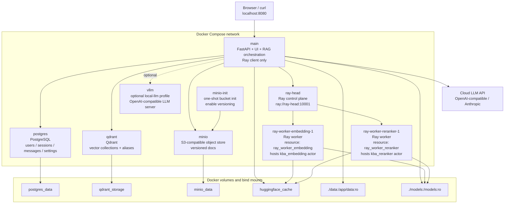
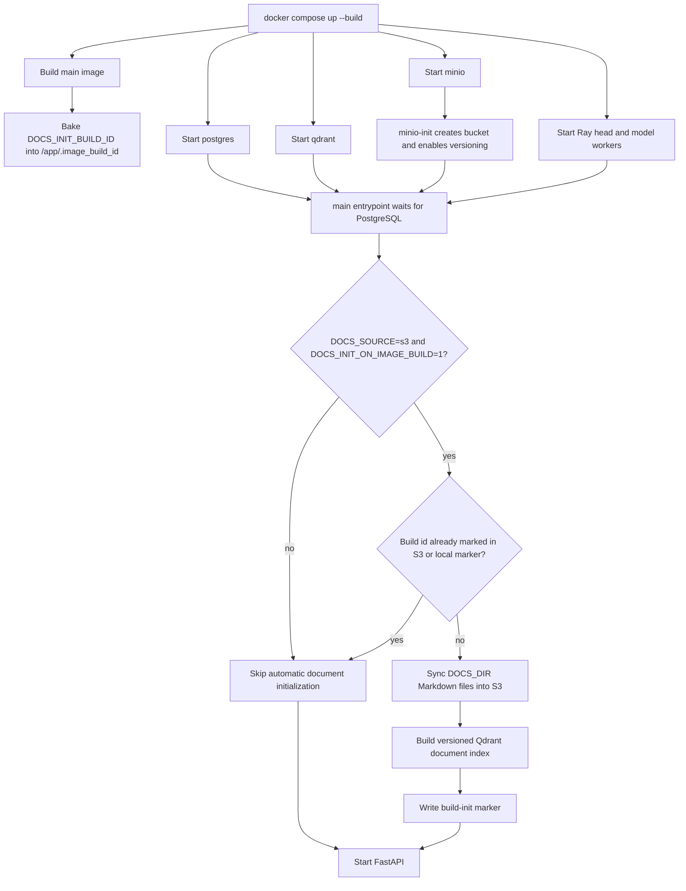
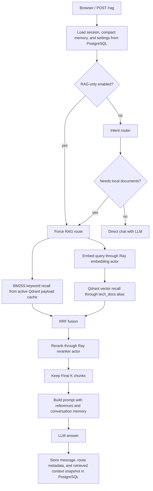
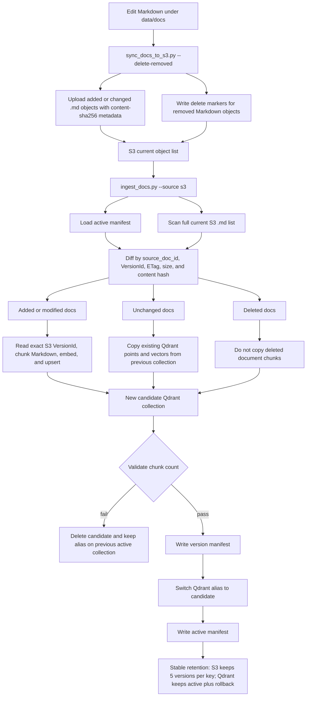

# Knowledge Base Assistant

中文文档见 [readme.zh.md](readme.zh.md).

Knowledge Base Assistant is a general-purpose chat application for exploring a
replaceable local Markdown knowledge base. It uses intent routing to choose
between retrieval-augmented answers grounded in the indexed corpus and direct
chat for requests that do not need retrieval.

Qdrant provides vector search, a local BM25 index provides keyword recall,
PostgreSQL stores required user accounts and account-scoped chat sessions,
SentenceTransformers generates embeddings, and FastAPI serves both the API and
browser UI. Generation is provider-configurable: the default setup targets an
OpenAI-compatible cloud API, Anthropic is supported, and a local vLLM service
remains available as an optional Docker Compose profile.

The repository currently ships with a synthetic restaurant/business case corpus
about 家是本, 朱剑秋, the Yongge livestream incident, menu pricing, customer
reviews, social-media reactions, financial simulation, and the 巨大历史机遇/巨大历史鲫鱼
slogan meme. The corpus is
intentionally niche so retrieval grounding matters more than pretrained model
memory. The intent router keeps its embedding layer domain-general, while the
keyword layer and LLM fallback prompt include lightweight corpus-specific
boundaries that should be updated when `data/docs/` is replaced.

## Highlights

- Docker Compose deployment for PostgreSQL, Qdrant, local MinIO S3 storage,
  Ray model workers, and FastAPI.
- Configurable cloud LLM providers with an optional local vLLM profile.
- Jina embeddings v5 text small by default, with task/prompt routing for
  retrieval-query, retrieval-passage, and classification embeddings.
- Replaceable Markdown corpus with isolated keyword hints for the bundled
  domain.
- Chat-style web UI at `/` with adjustable BM25, cosine, RRF, and final context
  counts.
- Required account login with PostgreSQL-backed chat sessions per user and an
  admin UI for user/data management.
- Admin CSV import for batch user creation with strict `email,passwd` format
  validation.
- Intent routing avoids vector search for clear direct-chat questions.
- Source references are shown when retrieval is used.
- Conversation history is stored server-side and compacted only when estimated
  prompt pressure approaches the active LLM context window.
- Runtime configuration is environment-driven through `.env`.
- The startup superuser can update the LLM provider, base URL, model, API key,
  and context-window size from the Admin UI without rebuilding containers.
- Supports Hugging Face cache volumes, local model directories, mirrors, and
  host-side HTTP proxy settings for restricted networks.
- Code Search for local source folders: CodeBERT file/function embeddings,
  AST-based Python/C++ symbol extraction, and static call graphs.

## Architecture

```text
Browser UI
   |
FastAPI /auth, /sessions, /rag
   |-- PostgreSQL users, login tokens, chat sessions, messages, summaries
   |
IntentRouter
   |-- keyword rules and previous-route strong follow-up state
   |-- Jina classification similarity over single-intent anchors
   |-- configured LLM fallback with previous route state
   |
RAGPipeline or Direct Chat
   |-- BM25 keyword recall + Qdrant vector recall -> RRF fusion
   |-- optional Jina cross-encoder reranking
   |-- OpenAI-compatible or Anthropic LLM API
   |
Answer + retrieved references + compacted conversation memory
```

Main modules:

- `app/main.py`: FastAPI routes, health check, and static UI serving.
- `app/static/`: browser chat UI — `index.html` shell, `css/styles.css`, and
  ES modules under `js/` (`store`, `api`, `dom`, `markdown`, and `views/`).
  Served directly by FastAPI with no build step.
- `app/session_store.py`: PostgreSQL-backed users, login tokens, chat sessions,
  messages, runtime LLM settings, route metadata, and compacted conversation
  summaries.
- `app/intent_router.py`: keyword/state, Jina-classification embedding, and
  tagged LLM fallback routing.
- `app/rag.py`: hybrid recall, RRF fusion, reranking, prompt construction, and
  context-budget-aware history compaction.
- `app/reranker.py`: Jina cross-encoder reranking for recalled chunks, using
  Ray actors when enabled.
- `app/vector_store.py`: Markdown chunking, Jina embeddings v5 task routing,
  BM25 indexing, Qdrant collection management, vector search, and RRF fusion.
- `app/code_indexer.py`: tree-sitter based Python/C++ source parsing, CodeBERT
  embeddings, Qdrant indexing, and PostgreSQL persistence for code files and
  functions.
- `app/code_retrieval.py`: CodeBERT-first source retrieval over files and
  functions, repo-wide function recall, lexical candidate expansion, and
  explicit text-only degradation reporting.
- `app/call_graph.py`: tree-sitter based call extraction and networkx directed
  call graph queries.
- `app/llm_client.py`: provider-aware client for cloud APIs or local vLLM.
- `scripts/`: manual service, ingest, retrieval smoke-test, and intent-router
  A/B evaluation commands.
- `data/docs/`: replaceable Markdown documents ingested into Qdrant.
- `data/eval/`: labeled intent-routing cases, including bilingual slices.

## Repository Contents

This repository is intended to be pushed without local runtime state. The
committed project should include:

- Source code under `app/`, `scripts/`, and `docker/`.
- Deployment files: `Dockerfile`, `compose.yaml`, `compose.cpu.yaml`,
  `.env.example`, and dependency files.
- Markdown corpus files under `data/docs/` and labeled routing evaluation
  cases under `data/eval/`.
- Contributor/project docs such as `readme.md` and `AGENTS.md`.

The repository should not include `.env`, model weights, Hugging Face caches,
PostgreSQL data, Qdrant storage, logs, virtual environments, or local editor
files. These are covered by `.gitignore`.

## Quick Start With Docker Compose

Prerequisites:

- Docker with Compose v2.
- A cloud LLM API key for the default cloud-backed setup.
- Optional: a compatible NVIDIA GPU, current NVIDIA driver, and NVIDIA
  Container Toolkit if you want Docker containers to use CUDA. Very old GPUs
  may not support the PyTorch/Transformers CUDA build used by the embedding
  model, reranker, or local vLLM profile.

Create local settings:

```bash
cp .env.example .env
```

Set `LLM_API_KEY` and, if needed, `LLM_MODEL` in `.env`. Account login is
always required and chat sessions are persisted per user in PostgreSQL. The
default administrator is created on startup:

```text
username: admin
password: 123456
```

Change `AUTH_DEFAULT_ADMIN_PASSWORD` before exposing the deployment beyond
local development. If the PostgreSQL volume already contains an `admin` user,
startup keeps that user's existing password. PostgreSQL runs inside Docker
Compose; you do not need to install PostgreSQL on the host.

Start PostgreSQL, Qdrant, MinIO-backed S3 storage, and the API:

```bash
docker compose up --build
```

Open the app:

```text
http://localhost:8080
```

For the local S3 console, open:

```text
http://localhost:9001
```

Default MinIO credentials are `minioadmin` / `minioadmin`; change them before
using the stack outside a local demo.

Use a different host port:

```bash
APP_PORT=9000 docker compose up --build
```

Then open `http://localhost:9000`.

After changing `.env` values, recreate the containers so the API sees the new
environment:

```bash
docker compose up -d --build --force-recreate
```

Stop services:

```bash
docker compose down
```

Reset persisted PostgreSQL, Qdrant, MinIO, and Hugging Face cache volumes:

```bash
docker compose down -v
```

## Startup Behavior

`compose.yaml` starts seven long-running services and one one-shot initializer
by default:

- `postgres`: runs PostgreSQL inside Docker and stores users, login tokens, and
  chat sessions in the `postgres_data` Docker volume.
- `qdrant`: stores vectors in the `qdrant_storage` Docker volume.
- `minio`: provides local S3-compatible object storage in the `minio_data`
  Docker volume.
- `minio-init`: creates the configured document bucket and enables S3 object
  versioning before the API starts.
- `ray-head`: owns the Ray cluster control plane and Ray client endpoint.
- `ray-worker-embedding-1`: runs the named document embedding actor and is
  tagged with Ray resource `ray_worker_embedding`.
- `ray-worker-reranker-1`: runs the named reranker actor and is tagged with Ray
  resource `ray_worker_reranker`.
- `main`: waits for Qdrant, PostgreSQL, and MinIO initialization, optionally
  runs document initialization, connects to Ray, and starts FastAPI on
  container port `8080`.

Docker service architecture:



Startup and image-bound document initialization:



Plain `docker compose restart` does not rescan local Markdown. A new image build
id, or an explicit `DOCS_INIT_BUILD_ID` change, is what makes the S3
initialization path run again during startup.

The `vllm` service is optional and only starts under the `local-llm` profile:

```bash
LLM_BASE_URL=http://vllm:8000/v1 \
LLM_API_KEY=token \
LLM_MODEL=Qwen/Qwen2.5-7B-Instruct \
VLLM_SERVED_MODEL_NAME=Qwen/Qwen2.5-7B-Instruct \
WAIT_FOR_LLM=1 \
LLM_HEALTH_CHECK_ENABLED=1 \
docker compose --profile local-llm up --build
```

Important startup flags:

```bash
INGEST_ON_STARTUP=0      # manual document ingest is the default
INGEST_USE_RAY=1         # document ingest embeddings run on Ray workers
RECREATE_COLLECTION=0    # local mode: rebuild collection; S3 mode: rebuild version
DOCS_INIT_ON_IMAGE_BUILD=1 # S3 mode: initialize docs once per image build id
DOCS_INIT_DELETE_REMOVED=1 # S3 build init removes remote docs missing locally
WAIT_FOR_LLM=0           # set to 1 when a local LLM service must be ready first
APP_PORT=8080            # host port mapped to FastAPI/UI
QDRANT_IMAGE=qdrant/qdrant:v1.18.1
POSTGRES_IMAGE=postgres:17-alpine
MINIO_IMAGE=minio/minio:latest
MINIO_API_PORT=9000      # local S3 API
MINIO_CONSOLE_PORT=9001  # local MinIO browser console
RAY_ADDRESS=ray://ray-head:10001
RAY_LOCAL_FALLBACK=0     # do not load embedding/reranker models in main
GRPC_ENABLE_FORK_SUPPORT=0 # keep Ray Client stable inside Compose containers
RAY_EMBEDDING_ACTOR_RESOURCE=ray_worker_embedding
RAY_RERANKER_ACTOR_RESOURCE=ray_worker_reranker
```

For fast restarts after the image has already been built:

```bash
docker compose up -d
```

## Code Search

Code Search is separate from the Markdown RAG index. Natural-language docs such
as `README.md`, install docs, and tutorials should still be ingested with the
existing Markdown path by setting `DOCS_DIR` to the relevant checkout or a
documentation subdirectory. Source files are indexed into separate Qdrant
collections and PostgreSQL tables. When `CODE_SOURCE_DIR` is empty, code search
discovers source folders directly under `CODE_ROOT_DIR` and lets the browser
select one folder or search across all indexed folders.

Default code settings:

```bash
DOCS_DIR=/app/data/docs
CODE_ROOT_DIR=/app/data/code
# Optional: CODE_SOURCE_DIR=/app/data/code/specific-repo
CODE_FILES_COLLECTION=code_files
CODE_FUNCTIONS_COLLECTION=code_functions
CODE_EMBEDDING_MODEL=microsoft/codebert-base
CODE_EMBEDDING_PRELOAD=0
CODE_EMBEDDING_PRELOAD_RETRIES=3
CODE_EMBEDDING_PRELOAD_RETRY_SECONDS=20
CODE_SEARCH_FILE_TOP_K=20
CODE_SEARCH_FUNCTION_TOP_K=50
CODE_SEARCH_FINAL_TOP_K=10
CODE_CALL_GRAPH_DEPTH=3
RAY_ENABLED=1
RAY_ADDRESS=ray://ray-head:10001
RAY_LOCAL_FALLBACK=0
GRPC_ENABLE_FORK_SUPPORT=0
RAY_CODE_EMBEDDING_ACTOR_NUM_GPUS=0
RAY_CODE_EMBEDDING_ACTOR_NAME=kba_code_embedding
```

The expected local data layout is:

```text
data/docs/         # original Markdown RAG corpus
data/code/repo-a/  # source folder selectable in Code Search
data/code/repo-b/  # another source folder
```

Run the stack with both folders mounted through `./data`:

```bash
docker compose up -d --build
```

Startup does not scan local Markdown on ordinary restarts. In local mode, run
`python scripts/ingest_docs.py` manually. In S3 mode, the container initializes
documents only once per Docker image build id: `docker compose up --build`
creates the image marker, the first container start syncs `DOCS_DIR` to S3 and
builds the versioned index, and later `docker compose restart` runs skip
without scanning. If you need to force S3 initialization without changing source
files, set `DOCS_INIT_BUILD_ID` to a new value before `docker compose up
--build`. Code indexes are built on demand: open the browser UI, switch to
`Code`, select the repository under `data/code`, and click `Index`. Selecting
`All code folders` indexes every discovered repository under `CODE_ROOT_DIR`.

The same operation is available through the API after retrieving an auth token
as shown below:

```bash
curl -sS http://localhost:8080/code/index \
  -H "authorization: Bearer ${TOKEN}" \
  -H 'content-type: application/json' \
  -d '{"repository_ids":["xgboost"],"rebuild":true}'
```

For operational scripts or CI, you can still build from the container shell:

```bash
docker compose exec -T main python scripts/index_code.py \
  --recreate
```

The indexer stores:

- `code_files` PostgreSQL table and `code_files` Qdrant collection: path,
  language, full source text in PostgreSQL, and a CodeBERT file embedding.
- `code_functions` PostgreSQL table and `code_functions` Qdrant collection:
  function/class name, signature, body, docstring, line range, and CodeBERT
  embedding.
- `code_call_edges` PostgreSQL table: AST-derived caller to callee edges.

Current code retrieval is CodeBERT-first, not a full BM25S+dense hybrid search.
On a normal request the API embeds the query with the Ray-hosted CodeBERT actor,
searches `code_files`, searches `code_functions` inside the top files, performs
an additional repo-wide `code_functions` vector search, and uses lexical matches
only to add function candidates. Lexical candidates are re-scored with their
stored CodeBERT vectors before final ranking. The final score is the CodeBERT
vector score plus a small code-aware lexical boost.

If CodeBERT query embedding fails, `/code/search` falls back to a PostgreSQL
lexical scan over code files and functions. That fallback is reported with
`retrieval_mode="text_only"`, `code_embedding_degraded=true`, and a
`degradation_reason`. This code lexical fallback is not BM25S yet; Markdown RAG
uses BM25S, while Code Search currently uses hand-scored code tokens for the
fallback path.

Test code search after login:

```bash
TOKEN=$(
  curl -sS http://localhost:8080/auth/login \
    -H 'content-type: application/json' \
    -d '{"username":"admin","password":"123456"}' \
  | python -c 'import json,sys; print(json.load(sys.stdin)["token"])'
)

curl -sS http://localhost:8080/code/search \
  -H "authorization: Bearer ${TOKEN}" \
  -H 'content-type: application/json' \
  -d '{"query":"DMatrix data handling"}'

curl -sS 'http://localhost:8080/code/call-graph?function_name=DMatrix.__init__&depth=3' \
  -H "authorization: Bearer ${TOKEN}"
```

The browser UI has a `Code` mode in the chat header. Code mode sends queries to
`/code/search`, renders function-level results, and uses the right-side panel
to render `/code/call-graph` with cytoscape.js.

## Configuration

Common settings from `.env.example`:

```bash
DEBUG=0
CUDA=TRUE
QDRANT_IMAGE=qdrant/qdrant:v1.18.1
DOCS_INIT_BUILD_ID=auto

LLM_PROVIDER=openai_compatible
LLM_BASE_URL=https://api.openai.com/v1
LLM_MODEL=gpt-4o-mini
LLM_API_KEY=
LLM_TEMPERATURE=0.2
LLM_TOP_P=0.9
LLM_MAX_TOKENS=4096
LLM_CONTEXT_MAX_TOKENS=256000
LLM_CONTEXT_SAFETY_MARGIN_TOKENS=8192
LLM_CONTEXT_PROMPT_OVERHEAD_TOKENS=2048
LLM_TIMEOUT_SECONDS=300
LLM_RETRY_ATTEMPTS=3
LLM_RETRY_BACKOFF_SECONDS=1
LLM_RETRY_BACKOFF_MAX_SECONDS=10
LLM_HEALTH_CHECK_ENABLED=0
LLM_HEALTH_PATH=
LLM_ANTHROPIC_VERSION=2023-06-01

API_TOP_K_MAX=20
API_RECALL_TOP_K_MAX=1000
API_MESSAGE_MAX_CHARS=16000
API_QUESTION_MAX_CHARS=16000
API_SUMMARY_MAX_CHARS=12000
API_HISTORY_MAX_MESSAGES=120

POSTGRES_USER=kba
POSTGRES_PASSWORD=kba_password
POSTGRES_DB=kba
DATABASE_CONNECT_TIMEOUT_SECONDS=5
AUTH_DEFAULT_ADMIN_ENABLED=1
AUTH_DEFAULT_ADMIN_USERNAME=admin
AUTH_DEFAULT_ADMIN_PASSWORD=123456
AUTH_BOOTSTRAP_USERS=
AUTH_SESSION_TTL_SECONDS=604800
SESSION_LIST_LIMIT=50
SESSION_TITLE_MAX_CHARS=80

DOCS_SOURCE=s3
DOCS_DIR=/app/data/docs
DOCS_S3_BUCKET=kba-docs
DOCS_S3_PREFIX=docs
DOCS_S3_ENDPOINT_URL=http://minio:9000
DOCS_S3_REGION=us-east-1
DOCS_S3_ACCESS_KEY_ID=minioadmin
DOCS_S3_SECRET_ACCESS_KEY=minioadmin
DOCS_S3_FORCE_PATH_STYLE=1
DOCS_S3_REQUIRE_VERSIONING=1
DOCS_S3_RETAIN_VERSIONS=5
DOCS_S3_PROCESSING_RETAIN_VERSIONS=6
DOCS_S3_MANIFEST_PREFIX=_kba/manifests/docs
DOCS_INIT_ON_IMAGE_BUILD=1
DOCS_INIT_DELETE_REMOVED=1
QDRANT_COLLECTION=tech_docs
QDRANT_RETAIN_VERSIONS=2
QDRANT_PROCESSING_RETAIN_VERSIONS=3
EMBEDDING_MODEL=jinaai/jina-embeddings-v5-text-small
EMBEDDING_TRUST_REMOTE_CODE=1
EMBEDDING_QUERY_TASK=retrieval
EMBEDDING_PASSAGE_TASK=retrieval
EMBEDDING_CLASSIFICATION_TASK=classification
EMBEDDING_QUERY_PROMPT_NAME=query
EMBEDDING_PASSAGE_PROMPT_NAME=document
EMBEDDING_CLASSIFICATION_PROMPT_NAME=
BM25_TOP_K=100
RECALL_TOP_K=100
RRF_TOP_K=100
RETRIEVE_TOP_K=5
RETRIEVE_SCORE_THRESHOLD=0
CHUNK_SIZE=2000
CHUNK_OVERLAP=300
RERANKER_ENABLED=1
RERANKER_MODEL=jinaai/jina-reranker-v3
RERANKER_PRELOAD=1
RERANKER_TRUST_REMOTE_CODE=1
RERANKER_DTYPE=auto
RERANKER_MAX_DOCUMENTS_PER_CALL=64

HISTORY_RECENT_TURNS=16
HISTORY_COMPACT_AFTER_TURNS=40
HISTORY_MAX_MESSAGES=0
MESSAGE_MAX_CHARS=8000
CONVERSATION_SUMMARY_MAX_CHARS=256000
SUMMARY_HISTORY_MAX_CHARS=200000
SUMMARY_MAX_TOKENS=4096
SEARCH_QUERY_MAX_CHARS=3000

INTENT_ROUTER_ENABLED=1
INTENT_LLM_FALLBACK=1
INTENT_LLM_HISTORY_MAX_CHARS=12000
INTENT_LLM_SUMMARY_MAX_CHARS=32000
INTENT_LLM_MAX_TOKENS=512
INTENT_EMBEDDING_HISTORY_MAX_CHARS=8000
INTENT_EMBEDDING_SUMMARY_MAX_CHARS=8000
INTENT_EMBEDDING_TEXT_MAX_CHARS=12000
INTENT_EMBEDDING_RAG_THRESHOLD=0.38
INTENT_EMBEDDING_DIRECT_THRESHOLD=0.40
INTENT_EMBEDDING_MARGIN=0.06
```

`LLM_PROVIDER=openai_compatible` works with OpenAI-compatible cloud APIs and
local vLLM. For Anthropic Claude, use `LLM_PROVIDER=anthropic` and
`LLM_BASE_URL=https://api.anthropic.com/v1`. Embeddings run through the
configured Ray embedding actor by default.

Leave `LLM_HEALTH_PATH` blank to use provider-specific health defaults:
OpenAI-compatible providers use `GET /models`, while Anthropic uses
`POST /messages/count_tokens`.

LLM chat requests retry transient provider errors (`429`, `502`, `503`, `504`)
with exponential backoff. Keep `DEBUG=0` outside local development so API errors
return generic messages while details stay in server logs.

The default embedding model is `jinaai/jina-embeddings-v5-text-small` with
`trust_remote_code` enabled. Document chunks and search queries both use the
`retrieval` task, with `document` and `query` prompt names respectively; the
second intent-router layer uses the `classification` task. Because the model
has a finite token window, the intent layer uses bounded recent history and
summary views rather than the full API-scale conversation summary. These intent
budgets are character-based safeguards; if the encoder still raises, the router
falls through to the LLM classifier instead of failing the request.

Intent routing is state-aware without feeding all history to every layer. The
first keyword layer routes general technical/database topics outside the local
corpus to direct chat, and uses the previous assistant route metadata only for
short, strong referential follow-ups such as "continue" or "后续呢？" after the
previous answer actually used retrieved contexts. New technical topics,
including general database/API questions, are not forced into RAG by that state
shortcut.
The second layer keeps local cached anchor vectors and compares the bounded
classification text against single-intent RAG/direct anchor queries. The third
LLM classifier receives structured previous-route state and decides ambiguous
follow-ups with the tagged
`<think>THINK_AND_JUDGEMENT</think><answer>JSON_ANS</answer>` format.
All users can enable the browser `RAG-only` switch for a request-level override:
when enabled, `/rag` receives `rag_only=true`, skips intent routing, and records
the route as `rag_only`.

Conversation memory is sized for large API-context models. The default context
window is `256000` tokens, with an `8192` token safety margin and `2048` token
prompt-overhead reserve. History is not count-truncated before compaction
(`HISTORY_MAX_MESSAGES=0`); instead, `RAGPipeline` estimates summary plus
uncompressed history and compacts only when that estimate would exceed the
active context window after reserving output, the current question, safety,
prompt overhead, and expected retrieved references. The superuser can override
the runtime LLM context-window size from the Admin UI.

When intent routing chooses RAG, the pipeline now performs hybrid recall before
reranking. It recalls `BM25_TOP_K` keyword candidates from the local Markdown
chunks with BM25, recalls `RECALL_TOP_K` cosine-similarity candidates from
Qdrant, fuses both ranked lists with reciprocal rank fusion, keeps
`RRF_TOP_K` fused candidates, reranks those candidates with the multilingual
`jinaai/jina-reranker-v3` cross-encoder, then keeps `RETRIEVE_TOP_K` chunks for
the LLM prompt and response references. The browser UI exposes these values as
`BM25 K`, `Cosine K`, `RRF K`, and `Final K`; defaults are `100`, `100`, `100`,
and `5`. Set `RETRIEVE_SCORE_THRESHOLD` above `0` to drop low-scoring vector
results before fusion. `/health/details` returns the active defaults so the UI
can initialize all four controls after login. With `CUDA=TRUE` (the default),
the Ray model workers expose GPU resources and run the Jina embedding model and
Jina reranker as detached named actors. The `main` container connects to
`ray://ray-head:10001` and, with `RAY_LOCAL_FALLBACK=0`, does not load those
models locally. Set `CUDA=FALSE` to force the Ray workers and actor resource
requests to CPU. The default API image uses the PyTorch CUDA runtime image, so
no host CUDA toolkit install is required.
`jina-reranker-v3` is a listwise reranker, so candidates are reranked in
batches of `RERANKER_MAX_DOCUMENTS_PER_CALL` when recall returns more than the
model should process in one call.

Query-time document RAG pipeline:



PostgreSQL does not store the canonical document chunks. It stores users,
sessions, runtime settings, messages, and retrieved-context snapshots for past
answers. The current chunk text lives in Qdrant payloads and is rebuildable
from the S3 source documents.

Retrieval degrades explicitly instead of failing silently. If BM25S keyword
recall fails, the answer continues with Qdrant/vector-only recall. If
Qdrant/vector recall fails, the answer falls back to BM25-only recall. If the
reranker actor fails, the pipeline skips reranking and uses the coarse RRF
result list, capped by `Final K`. Responses and stored assistant messages include
`retrieval_degraded`, `qdrant_degraded`, `reranker_degraded`, and
`degradation_reason`; server logs write the same booleans, and the browser
shows a degraded retrieval notice beside the answer and references.

The default Compose configuration exposes NVIDIA GPU devices to
`ray-worker-embedding-1` and `ray-worker-reranker-1`, while the `main` container
remains a Ray client and does not request GPUs:

```bash
docker compose up --build
```

For a portable startup that tries GPU first and retries on CPU if Docker rejects
GPU device allocation, use the wrapper:

```bash
scripts/compose_up.sh up --build
```

On machines where you want to force CPU from the start, use the CPU override:

```bash
CUDA=FALSE docker compose -f compose.yaml -f compose.cpu.yaml up --build
```

If Docker exposes GPU devices but PyTorch cannot use them, or the GPU
architecture is too old for the installed CUDA/PyTorch build, the application
falls back to CPU after it starts.

Account login and PostgreSQL-backed sessions are always enabled. By default,
startup creates an administrator account if it does not already exist:

```text
username: admin
password: 123456
```

Change `AUTH_DEFAULT_ADMIN_PASSWORD` before exposing the app beyond local
development. Existing users are not overwritten on restart. The startup-created
default administrator is also the single superuser. Only this superuser can
edit runtime LLM settings from the Admin panel: provider format
(`openai_compatible` or `anthropic`), API base URL, model name, context-window
size, and API key.
These runtime values are stored in PostgreSQL and override the `.env` LLM
defaults without rebuilding the container; `.env` remains the bootstrap
fallback. History compaction reads the runtime context-window value before every
answer. API keys are never returned to the browser, and leaving the key field
blank keeps the current key. You can also add non-admin initial users through
`AUTH_BOOTSTRAP_USERS`, for example:

```bash
AUTH_BOOTSTRAP_USERS=analyst:change-me
```

Bootstrap users are inserted only when they do not already exist. Passwords are
stored as PBKDF2-SHA256 hashes, login bearer tokens are stored as SHA-256
hashes, and each user's chat sessions, messages, retrieved references, route
metadata, and compacted summary are stored in PostgreSQL. The browser opens to
the sign-in form and only shows the RAG workspace after a valid login.
Administrators see an Admin panel for creating users, importing users from CSV,
deleting users, resetting passwords, toggling admin access, and clearing a
user's chat data. Superuser-only controls for global LLM settings are shown in
the same Admin panel. CSV imports must contain exactly two columns named
`email` and `passwd`; rows with missing values, wrong headers, or extra columns
are rejected. `/rag` accepts a `session_id` and manages history server-side.

## Replace the Knowledge Base

The Markdown files under `data/docs/` provide the runtime domain content.
Ingestion scans that tree recursively, so nested topic folders are supported.
The committed files cover a generated restaurant/business case corpus about
家是本, 朱剑秋, and the 巨大历史机遇/巨大历史鲫鱼 meme. Because these topics are
unlikely to be memorized well by general models, they are a better fit for RAG
evaluation than common SQL or database-system facts. The bundled docs
intentionally do not include general DB/SQL reference material; database
questions stay in the direct-chat/evaluation-negative path instead of being
made into RAG content.

To use another subject:

1. Replace or edit the Markdown files under `data/docs/`.
2. For local mode, rebuild the Qdrant collection with
   `python scripts/ingest_docs.py --recreate`. For S3 mode, sync the files with
   `python scripts/sync_docs_to_s3.py --delete-removed`, then run
   `python scripts/ingest_docs.py --source s3`.
3. Update the corpus keyword hints in `app/intent_router.py`
   (`DOMAIN_RAG_PHRASES` and `DOMAIN_RAG_PATTERNS`), the LLM fallback corpus
   description, and `data/eval/intent_router_cases.jsonl` if first-pass,
   embedding, and fallback intent routing should recognize the new topic.
4. Keep any edited `RAG_ANCHORS`/`DIRECT_ANCHORS` as single-intent query-like
   anchors so the second layer remains interpretable.
5. Run `python scripts/intent_router_ab.py --fake-embedder`; when model weights
   are available, run a real encoder comparison.
6. Ask questions about the new corpus through the same UI or `/rag` API.

## Restricted Network Setup

Docker daemon proxy settings only help image pulls. Runtime containers need
their own proxy or mirror settings in `.env`.

For a Hugging Face mirror:

```bash
HF_ENDPOINT=https://hf-mirror.com
```

For host-side Mihomo, enable Allow LAN / bind to `0.0.0.0`, then set:

```bash
DOCKER_HTTP_PROXY=http://host.docker.internal:7890
DOCKER_HTTPS_PROXY=http://host.docker.internal:7890
DOCKER_NO_PROXY=postgres,qdrant,minio,vllm,main,ray-head,ray-worker-embedding-1,ray-worker-reranker-1,localhost,127.0.0.1,::1,10.0.0.0/8,172.16.0.0/12,192.168.0.0/16
GRPC_ENABLE_FORK_SUPPORT=0
```

Do not use `127.0.0.1` for the proxy host inside containers; it points to the
container itself. The Compose file maps `host.docker.internal` for `main`,
`ray-head`, and both Ray workers so model downloads can use the same host-side
proxy from every model-serving container.

## Offline Models

You can mount local model directories through `./models:/models:ro`:

```text
models/
  jina-embeddings-v5-text-small/
  qwen2.5-7b-instruct/
```

Then configure:

```bash
EMBEDDING_MODEL=/models/jina-embeddings-v5-text-small
EMBEDDING_TRUST_REMOTE_CODE=1
VLLM_MODEL=/models/qwen2.5-7b-instruct
LLM_MODEL=qwen2.5-7b-instruct
```

## API Usage

Health check:

```bash
curl http://localhost:8080/health
```

Log in first and use the returned bearer token:

```bash
TOKEN="$(
  curl -s http://localhost:8080/auth/login \
    -H "Content-Type: application/json" \
    -d '{"username":"admin","password":"123456"}' \
    | python3 -c 'import json,sys; print(json.load(sys.stdin)["token"])'
)"
```

Authenticated health details:

```bash
curl http://localhost:8080/health/details \
  -H "Authorization: Bearer ${TOKEN}"
```

RAG request:

```bash
SESSION_ID="$(
  curl -s http://localhost:8080/sessions \
    -H "Authorization: Bearer ${TOKEN}" \
    -X POST \
    | python3 -c 'import json,sys; print(json.load(sys.stdin)["id"])'
)"

curl http://localhost:8080/rag \
  -H "Content-Type: application/json" \
  -H "Authorization: Bearer ${TOKEN}" \
  -d "{
    \"session_id\": \"${SESSION_ID}\",
    \"question\": \"When should I choose DuckDB over ClickHouse?\",
    \"bm25_top_k\": 100,
    \"recall_top_k\": 100,
    \"rrf_top_k\": 100,
    \"top_k\": 5
  }"
```

Response fields:

- `answer`: generated response.
- `contexts`: reranked chunks with `source`, `chunk_id`, fused `score`,
  optional `rerank_score`, `vector_score`, `bm25_score`, `rrf_score`,
  `retrieval_source`, `content_type`, `headings`, line bounds, and `h1`/`h2`/`h3`
  metadata.
- `conversation_summary`: compact memory for future turns.
- `compacted_history_messages`: number of old messages merged into memory.
- `used_rag`: whether RAG retrieval was used for this answer.
- `route` and `route_reason`: intent-router decision metadata.

The same `contexts` payload is stored with assistant messages in PostgreSQL, so
it is the most reliable way to verify which retrieval stages were used. A
`retrieval_source` of `hybrid` has both `vector_score` and `bm25_score`; a pure
vector or BM25 hit has only the corresponding score. `rrf_score` confirms RRF
fusion, and `rerank_score` confirms the cross-encoder reranker ran. Docker logs
may not show these INFO-level retrieval events unless the Python logging level
is configured to emit application INFO logs.

## Manual Development

Set up Python dependencies with uv:

```bash
env UV_CACHE_DIR=.uv-cache uv venv --python 3.12 .venv
source .venv/bin/activate
uv pip install -r requirements.api.txt
```

Or use an existing Conda environment:

```bash
conda activate rag_llm
pip install -r requirements.txt
```

`requirements.txt` lists direct development dependencies only; transitive pins
are intentionally not committed as a `pip freeze` dump.

For API development with a configured LLM API and Docker-managed Qdrant, the
smaller runtime dependency set is:

```bash
pip install -r requirements.api.txt
```

Start local services manually:

```bash
bash scripts/start_qdrant.sh
bash scripts/start_vllm.sh
```

Ingest Markdown:

```bash
python scripts/ingest_docs.py --recreate
```

Smoke-test retrieval:

```bash
python scripts/test_retrieve.py
```

Smoke-test Markdown chunking:

```bash
python scripts/test_chunking.py
```

Smoke-test incremental document replacement:

```bash
python scripts/test_vector_store.py
```

Smoke-test intent routing:

```bash
python scripts/test_intent_router.py
```

Run offline intent-router A/B evaluation:

```bash
python scripts/intent_router_ab.py --fake-embedder
python scripts/intent_router_ab.py \
  --model-variant old_bge=BAAI/bge-small-en-v1.5,,0 \
  --json-report /tmp/intent_router_ab_report.json
```

Smoke-test cross-encoder reranker ordering with a fake model:

```bash
python scripts/test_reranker.py
```

Smoke-test prompt budgeting and history trimming:

```bash
python scripts/test_prompt_budget.py
```

Smoke-test configuration wiring:

```bash
python scripts/test_settings.py
```

Run FastAPI:

```bash
uvicorn app.main:app --host 0.0.0.0 --port 8080
```

Run a quick syntax check before pushing:

```bash
python -m compileall app scripts
```

## Document Corpus

In local mode, Markdown files in `data/docs/` are the RAG source of truth. In
S3 mode, the configured S3 bucket/prefix is the source of truth and
`QDRANT_COLLECTION` is treated as a stable Qdrant alias that points at the
active versioned collection. The bundled sample files cover a generated Chinese
restaurant/business case: company overview, FAQ, menu and pricing, customer
reviews, Bilibili comments, social-media archives, financial simulation, a
timeline, a profile of 朱剑秋, the Yongge livestream incident, the 巨大历史机遇/巨大历史鲫鱼
meme document, and a song document. Retrieval uses BM25 keyword recall plus
Qdrant vector recall, RRF fusion, and optional reranking.

The keyword intent layer contains domain hints for this bundled corpus in
`app/intent_router.py`. Those hints only decide whether to use RAG; they do not
rank documents. Replace them when swapping in a different corpus, and update
`data/eval/intent_router_cases.jsonl` so encoder and threshold changes are
checked against representative routing examples.

Chunking is Markdown-aware and metadata-driven: Markdown blocks are parsed,
headings are stored as `h1`/`h2`/`h3` payload metadata, and text, code, and
tables are chunked separately. Heading context is included in embedding input
but kept separate from stored chunk text to avoid duplicating titles in every
chunk. Oversized text chunks use an effective chunk budget that leaves room for
overlap, while fenced code chunks preserve complete fences.

Local filesystem ingest remains available for small corpora:

```bash
python scripts/ingest_docs.py
```

Each current Markdown file replaces all previously indexed chunks with the same
`source`, so edited or shortened files do not leave stale chunks behind. Local
mode still requires `--recreate` when deleting documents, replacing the whole
corpus, or changing the embedding model's vector size:

```bash
python scripts/ingest_docs.py --recreate
```

The local demo uses MinIO as an S3-compatible store by default. For
production-style document updates, point the same S3 versioned ingest path at a
real bucket or another S3-compatible service:

```bash
DOCS_SOURCE=s3
DOCS_S3_BUCKET=my-docs-bucket
DOCS_S3_PREFIX=docs
DOCS_S3_ENDPOINT_URL=        # leave blank for AWS S3, or set your compatible endpoint
QDRANT_COLLECTION=tech_docs
```

Enable bucket versioning before ingest. Then sync local Markdown into S3 and
build a new index version manually:

```bash
python scripts/sync_docs_to_s3.py --docs-dir data/docs --delete-removed
python scripts/ingest_docs.py --source s3
```

Incremental S3 document update:



The S3 indexer always scans the current S3 object list to detect additions,
modifications, and deletions. It does not only scan changed objects. The
previous active manifest is stored under `DOCS_S3_MANIFEST_PREFIX`; every chunk
payload includes `source_doc_id` and `version_id`. A new physical Qdrant
collection is created for each index version. Unchanged document chunks are
copied from the previous collection with their vectors, added/modified
documents are chunked and embedded, and deleted documents are not copied. After
the new collection validates successfully, the `QDRANT_COLLECTION` alias is
switched to the new collection. Old physical collections and S3 object versions
remain available for rollback.

Retention is enabled by default. Stable S3 document object versions keep the
latest 5 versions per Markdown key, including the latest usable version.
Stable Qdrant document indexes keep the latest 2 version collections, including
the active alias target. During an ingest run the limits are temporarily relaxed
to 6 S3 versions and 3 Qdrant collections, so the new candidate version can be
built without deleting the last known-good version. If the ingest fails after
creating a collection or switching the alias, the alias is rolled back to the
previous collection and the failed candidate collection is deleted.

## Before Pushing to GitHub

Run these checks from the repository root:

```bash
git status --short --ignored
python -m compileall app scripts
python scripts/test_chunking.py
python scripts/test_vector_store.py
python scripts/test_intent_router.py
python scripts/test_prompt_budget.py
python scripts/test_settings.py
docker compose config
```

Expected ignored local paths may include `.env`, `.vscode/`, `qdrant_storage/`,
`models/`, and `__pycache__/`. Do not add those files. New source files such as
`app/intent_router.py`, `app/static/index.html`, data docs, and scripts should
be tracked.

## Git Hygiene

Do not commit `.env`, API keys, Hugging Face tokens, model weights, Qdrant
storage, cache directories, virtual environments, or logs. Runtime state such as
`qdrant_storage/`, `models/`, `.cache/`, local database files, and `.env` is
intentionally ignored.
