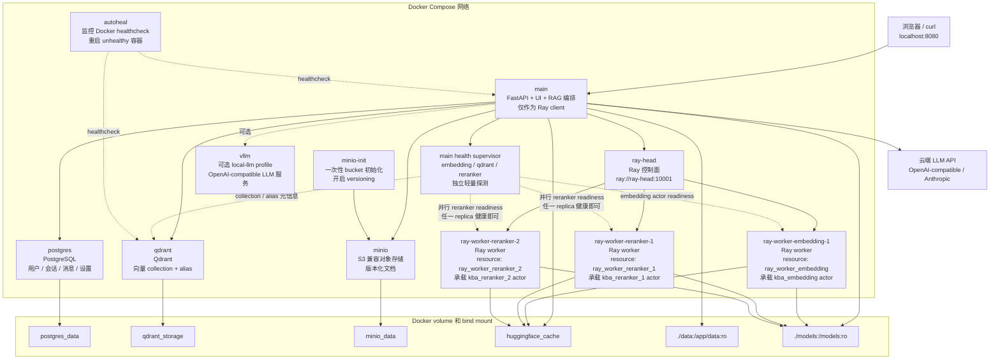
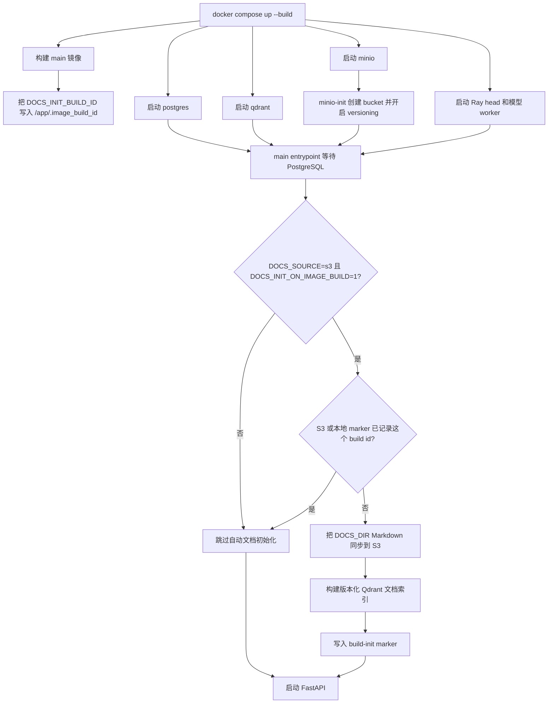
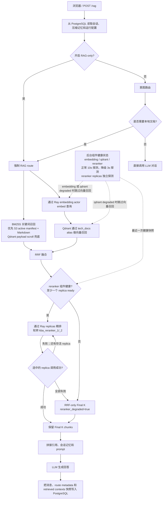
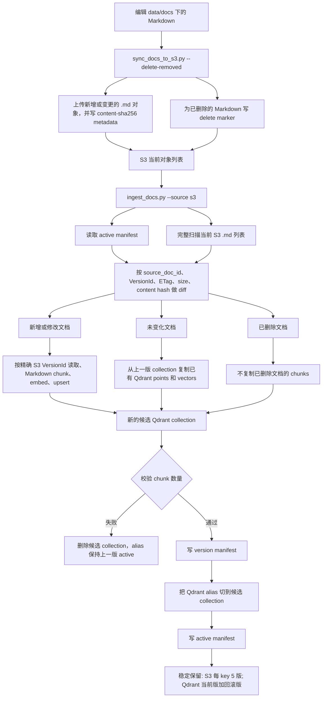

# Knowledge Base Assistant

Knowledge Base Assistant 是一个通用知识库问答应用，用于查询可替换的本地
Markdown 文档库。系统会通过意图路由判断问题是否需要检索：需要文档依据时走
RAG，不需要检索的请求走直接对话。

Qdrant 负责向量检索，本地 BM25 索引负责关键词召回，PostgreSQL 负责必需的用户
账号、登录 token、用户会话、消息和压缩后的对话记忆，SentenceTransformers 负责
本地 embedding，FastAPI 同时提供 API 和浏览器界面。生成模型通过环境变量配置，
默认使用 OpenAI-compatible API，也支持 Anthropic；本地 vLLM 作为可选 Docker
Compose profile 保留。

仓库当前自带一组由 Kimi 生成的餐饮创业案例 Markdown 语料，围绕家是本、
朱剑秋、勇哥连线、菜单定价、顾客评价、社交媒体反应、财务模拟以及
“巨大历史机遇/巨大历史鲫鱼”梗展开。这类
小众合成语料比常见 SQL 或数据库知识更适合检验 RAG grounding，因为通用模型
不太可能从预训练中直接记住这些细节。当前 `data/docs/` 不包含通用 DB/SQL
参考资料；数据库问题作为 direct-chat / eval negative 保留，不作为 RAG 语料。
意图路由的 embedding 层保持通用；关键词层和 LLM fallback prompt 包含当前语料的
边界与专名提示，替换 `data/docs/` 后应同步更新。

## 功能概览

- Docker Compose 一键启动 PostgreSQL、Qdrant、本机 MinIO S3 对象存储、Ray
  model worker 和 FastAPI。
- 必须登录账号后才能使用 RAG 系统，没有匿名访问模式。
- 默认管理员账号为 `admin / 123456`，可通过环境变量改默认密码。
- 管理员可以在前端创建用户、删除用户、重置密码、切换管理员权限、清空用户会话。
- 管理员可以上传 CSV 批量创建用户；CSV 必须只有两列，表头必须为 `email,passwd`。
- 支持 OpenAI-compatible、Anthropic 和可选本地 vLLM。
- 默认使用 `jinaai/jina-embeddings-v5-text-small`，并为查询、文档和意图分类分别使用
  `retrieval` task + `query`/`document` prompt，以及 `classification` task。
- Markdown 语料可替换，当前语料的关键词提示集中在意图路由 keyword 层。
- 前端支持多会话、BM25 K、Cosine K、RRF K、Final K 调整、引用展示和路由结果展示。
- 对话历史保存在后端，只在估算 prompt 接近当前 LLM 上下文窗口时才压缩成
  summary。
- 唯一 superuser 可在 Admin UI 中修改全局 LLM provider、API URL、模型名、
  API key 和上下文窗口大小，保存后不需要 rebuild。
- 支持 Hugging Face cache、离线模型目录、镜像和容器运行时代理配置。
- 支持本地源码 Code Search：Python/C++ AST 符号抽取、CodeBERT 文件/函数向量、
  PostgreSQL 原文存储、Qdrant 代码 collection 和静态调用图。

## 架构

```text
Browser UI
   |
FastAPI /auth, /sessions, /rag
   |-- PostgreSQL users, login tokens, chat sessions, messages, summaries
   |
IntentRouter
   |-- keyword rules and previous-route strong follow-up state
   |-- Jina classification similarity over single-intent anchors
   |-- configured LLM fallback with previous route state
   |
RAGPipeline or Direct Chat
   |-- BM25 keyword recall + Qdrant vector recall -> RRF fusion
   |-- optional Jina cross-encoder reranking
   |-- OpenAI-compatible or Anthropic LLM API
   |
Answer + retrieved references + compacted conversation memory
```

主要模块：

- `app/main.py`：FastAPI 路由、健康检查、静态前端。
- `app/static/index.html`：浏览器聊天界面和管理员界面。
- `app/session_store.py`：PostgreSQL 用户、登录 token、会话、消息、运行时
  LLM 设置、路由元数据和 summary。
- `app/intent_router.py`：关键词/状态机、Jina classification embedding 和
  tagged LLM fallback 意图路由。
- `app/rag.py`：混合召回、RRF 融合、重排、prompt 构造、基于上下文预算的历史压缩。
- `app/reranker.py`：Jina cross-encoder 重排；启用 Ray 时通过 actor 调用。
- `app/vector_store.py`：Markdown 切块、Jina embeddings v5 task 路由、BM25
  索引、Qdrant collection 管理、向量搜索和 RRF 融合。
- `app/code_indexer.py`：基于 tree-sitter 的 Python/C++ 源码解析、CodeBERT
  embedding、Qdrant 代码索引和 PostgreSQL 代码文件/函数持久化。
- `app/code_retrieval.py`：CodeBERT-first 的源码检索、repo-wide 函数召回、
  lexical 候选扩展和显式 text-only 降级报告。
- `app/call_graph.py`：AST 调用边抽取和 networkx 有向调用图查询。
- `app/llm_client.py`：不同 LLM provider 的请求封装。
- `scripts/`：ingest、服务启动、smoke test 和 intent-router A/B 评估脚本。
- `data/docs/`：被 ingest 到 Qdrant 的 Markdown 语料。
- `data/eval/`：带标签的 intent-router 评估样本，包含双语/跨语种切片。

## 快速启动

准备 Docker Compose v2 和一个云端 LLM API key。如果希望 Docker 容器使用
CUDA，还需要兼容的 NVIDIA GPU、较新的 NVIDIA 驱动和 NVIDIA Container
Toolkit；过老的显卡可能不支持当前 PyTorch/Transformers CUDA 构建。复制配置：

```bash
cp .env.example .env
```

在 `.env` 中设置 `LLM_API_KEY`，必要时设置 `LLM_MODEL`。默认启动时会创建管理
员账号：

```text
username: admin
password: 123456
```

生产或公网环境必须修改 `AUTH_DEFAULT_ADMIN_PASSWORD`。如果 PostgreSQL volume 中
已经存在 `admin` 用户，启动时不会覆盖该用户当前密码。启动时创建的默认
administrator 同时是唯一 superuser；只有这个 superuser 能在前端 Admin 面板修改
全局 LLM 配置，包括 API 格式（`openai_compatible` 或 `anthropic`）、API URL、
模型名、上下文窗口大小和 API key。前端保存后配置写入 PostgreSQL 并覆盖 `.env`
中的 LLM 默认值，不需要 rebuild 容器；`.env` 仍作为首次启动和未配置时的
fallback。API key 不会回显给浏览器，保存时 key 输入框留空表示保留当前 key。

启动 PostgreSQL、Qdrant、本机 MinIO S3 存储和 API：

```bash
docker compose up --build
```

打开：

```text
http://localhost:8080
```

本机 S3 控制台：

```text
http://localhost:9001
```

默认 MinIO 账号密码是 `minioadmin` / `minioadmin`；离开本机 demo 前需要修改。

使用其他宿主机端口：

```bash
APP_PORT=9000 docker compose up --build
```

修改 `.env` 后重建容器：

```bash
docker compose up -d --build --force-recreate
```

停止服务：

```bash
docker compose down
```

清空 PostgreSQL、Qdrant、MinIO 和 Hugging Face cache volume：

```bash
docker compose down -v
```

默认 `compose.yaml` 会启动 PostgreSQL、Qdrant、MinIO、Ray head、三个 Ray
model worker 和 `main` API 服务。`ray-worker-embedding-1` 带 Ray resource
`ray_worker_embedding`，用于文档 embedding actor；`ray-worker-reranker-1` 和
`ray-worker-reranker-2` 分别带 `ray_worker_reranker_1` 和
`ray_worker_reranker_2`，用于两个 reranker actor replica。`main` 容器只连接
`ray://ray-head:10001`，默认 `RAY_LOCAL_FALLBACK=0`，不会把 embedding/reranker
模型加载回 API 进程。Compose 还会启动 `autoheal`，它根据 Docker healthcheck
重启适合单容器自愈的服务，例如 `qdrant` 和 `main`；Ray head/worker 不交给
autoheal 单独重启，避免把已有 Ray cluster 连接关系打散。

Docker 服务架构：



默认 Compose 启动和镜像绑定的文档初始化流程：



普通 `docker compose restart` 不会重新扫描本地 Markdown。只有新的 `main` 镜像 build
id，或显式修改 `DOCS_INIT_BUILD_ID`，才会让启动阶段再次执行 S3 文档初始化。

## 登录和用户管理

应用现在始终要求账号登录。浏览器打开后只显示 `Account` 和 `Password` 登录框；
登录成功后才显示 RAG 工作区、会话列表和引用面板。

管理员 CSV 批量导入格式必须严格如下：

```csv
email,passwd
alice@example.com,secret
bob@example.com,another-secret
```

规则：

- 表头必须精确为 `email,passwd`。
- 每行必须只有两列。
- `email` 和 `passwd` 都不能为空。
- 表头错误、缺值、多列、空文件都会被后端拒绝。
- 导入的账号为普通用户，不会自动授予管理员权限。
- 用户名会按现有规则标准化为小写；允许字母、数字、下划线、短横线、点和 `@`。

也可以通过 `.env` 预置普通用户：

```bash
AUTH_BOOTSTRAP_USERS=analyst:change-me,viewer:change-me-too
```

这些用户只会在不存在时创建，重启不会覆盖已有用户密码。

## 配置要点

常用配置见 `.env.example`：

```bash
DEBUG=0
CUDA=TRUE
DOCS_INIT_BUILD_ID=auto

LLM_PROVIDER=openai_compatible
LLM_BASE_URL=https://api.openai.com/v1
LLM_MODEL=gpt-4o-mini
LLM_API_KEY=
LLM_MAX_TOKENS=4096
LLM_CONTEXT_MAX_TOKENS=256000
LLM_CONTEXT_SAFETY_MARGIN_TOKENS=8192
LLM_CONTEXT_PROMPT_OVERHEAD_TOKENS=2048

POSTGRES_USER=kba
POSTGRES_PASSWORD=kba_password
POSTGRES_DB=kba
AUTOHEAL_IMAGE=willfarrell/autoheal:1.2.0
AUTOHEAL_INTERVAL=10
AUTOHEAL_START_PERIOD=30
AUTH_DEFAULT_ADMIN_ENABLED=1
AUTH_DEFAULT_ADMIN_USERNAME=admin
AUTH_DEFAULT_ADMIN_PASSWORD=123456
AUTH_BOOTSTRAP_USERS=

QDRANT_COLLECTION=tech_docs
DOCS_SOURCE=s3
DOCS_DIR=/app/data/docs
DOCS_S3_BUCKET=kba-docs
DOCS_S3_PREFIX=docs
DOCS_S3_ENDPOINT_URL=http://minio:9000
DOCS_S3_REGION=us-east-1
DOCS_S3_ACCESS_KEY_ID=minioadmin
DOCS_S3_SECRET_ACCESS_KEY=minioadmin
DOCS_S3_FORCE_PATH_STYLE=1
DOCS_S3_REQUIRE_VERSIONING=1
DOCS_S3_RETAIN_VERSIONS=5
DOCS_S3_PROCESSING_RETAIN_VERSIONS=6
DOCS_S3_MANIFEST_PREFIX=_kba/manifests/docs
DOCS_INIT_ON_IMAGE_BUILD=1
DOCS_INIT_DELETE_REMOVED=1
QDRANT_RETAIN_VERSIONS=2
QDRANT_PROCESSING_RETAIN_VERSIONS=3
EMBEDDING_MODEL=jinaai/jina-embeddings-v5-text-small
EMBEDDING_TRUST_REMOTE_CODE=1
EMBEDDING_QUERY_TASK=retrieval
EMBEDDING_PASSAGE_TASK=retrieval
EMBEDDING_CLASSIFICATION_TASK=classification
EMBEDDING_QUERY_PROMPT_NAME=query
EMBEDDING_PASSAGE_PROMPT_NAME=document
EMBEDDING_CLASSIFICATION_PROMPT_NAME=
BM25_TOP_K=100
RECALL_TOP_K=100
RRF_TOP_K=100
RETRIEVE_TOP_K=5
CHUNK_SIZE=2000
CHUNK_OVERLAP=300
RERANKER_ENABLED=1
RERANKER_MODEL=jinaai/jina-reranker-v3
RERANKER_PRELOAD=1
RERANKER_TRUST_REMOTE_CODE=1
RERANKER_DTYPE=auto
RERANKER_MAX_DOCUMENTS_PER_CALL=64
RAY_RERANKER_ACTOR_REPLICAS=2

HISTORY_RECENT_TURNS=16
HISTORY_MAX_MESSAGES=0
CONVERSATION_SUMMARY_MAX_CHARS=256000
SUMMARY_HISTORY_MAX_CHARS=200000
SUMMARY_MAX_TOKENS=4096

INTENT_LLM_HISTORY_MAX_CHARS=12000
INTENT_LLM_SUMMARY_MAX_CHARS=32000
INTENT_LLM_MAX_TOKENS=512
INTENT_EMBEDDING_HISTORY_MAX_CHARS=8000
INTENT_EMBEDDING_SUMMARY_MAX_CHARS=8000
INTENT_EMBEDDING_TEXT_MAX_CHARS=12000

INGEST_ON_STARTUP=0
INGEST_USE_RAY=1
RECREATE_COLLECTION=0
WAIT_FOR_LLM=0

HEALTH_PROBE_INTERVAL_SECONDS=10
HEALTH_PROBE_DEGRADED_INTERVAL_SECONDS=3
HEALTH_PROBE_TIMEOUT_SECONDS=2
HEALTH_PROBE_FAILURE_THRESHOLD=2
HEALTH_PROBE_RECOVERY_THRESHOLD=2
```

当意图路由判断需要 RAG 时，系统会先用 BM25S 从当前生效的 Markdown chunk 召回
`BM25_TOP_K` 个关键词候选，再从 Qdrant 召回 `RECALL_TOP_K` 个余弦相似度候选，
然后用 RRF（reciprocal rank fusion）融合两路排序并保留 `RRF_TOP_K` 个候选，
再使用多语言 `jinaai/jina-reranker-v3` cross-encoder 重排，最后只保留
`RETRIEVE_TOP_K` 个 chunk 进入 LLM prompt 和引用列表。前端对应控件为 `BM25 K`、
`Cosine K`、`RRF K` 和 `Final K`，默认分别为 `100`、`100`、`100` 和 `5`。
`/health/details` 会返回当前生效的默认值，前端登录后用这些值初始化四个控件。
默认 embedding 模型是 `jinaai/jina-embeddings-v5-text-small`。文档 chunk 和
检索 query 都使用 `retrieval` task，并分别使用 `document` 和 `query` prompt；
意图路由第二层使用 `classification`。Jina encoder 有有限 token 窗口，因此第二层只使用有界的最近
history 和 summary 视图，不会直接把 256K 级别的主 summary 整段喂给 encoder。
这些 intent 预算目前是字符级保护；如果 encoder 仍然报错，router 会跳过第二层并
进入 LLM classifier，而不是让请求失败。

意图路由是状态感知的，但不会把所有历史塞给每一层。第一层会把当前语料外的通用
技术/数据库问题判 direct；也只在上一轮 assistant 确实使用过检索 contexts，且
本轮是“继续讲”“后续呢？”这类短强回指时，才通过 `state_rag` 直接走 RAG。
带新技术名词的追问不会因为上一轮 RAG 被强制检索。
第二层继续使用本地缓存的 anchor 向量和 NumPy 点积，所有 `RAG_ANCHORS` /
`DIRECT_ANCHORS` 都应保持单意图 query。第三层 LLM classifier 会收到结构化的
上一轮 route state，并用
`<think>THINK_AND_JUDGEMENT</think><answer>JSON_ANS</answer>` 输出格式判断
模糊追问。
所有用户都可以在浏览器设置中打开 `RAG-only` 开关。开启后，请求会携带
`rag_only=true`，后端跳过意图路由并强制检索，route 记录为 `rag_only`。

对话 summary 的默认预算按 API 长上下文模型设置：
`LLM_CONTEXT_MAX_TOKENS=256000`、安全余量 `8192`、prompt overhead `2048`。
`HISTORY_MAX_MESSAGES=0` 表示压缩前不按消息条数截断；`RAGPipeline` 会估算
summary + 未压缩 history，并在扣除输出、当前 query、安全余量、prompt overhead 和
预期引用 token 后接近上下文上限时才触发压缩。唯一 superuser 可以在 Admin UI
修改运行时 LLM context window，后续回答会使用该值。

`CUDA=TRUE` 是默认值，Ray model worker 会暴露 GPU 资源，并把 1 个 Jina
embedding actor 和 2 个 Jina reranker actor replica 作为 detached named actor
常驻。`main` 容器只连接
`ray://ray-head:10001`；默认 `RAY_LOCAL_FALLBACK=0`，Ray Actor 不可用时不会在
API 进程本地加载这些模型。设置 `CUDA=FALSE` 可强制 Ray worker 和 actor 资源请求
都走 CPU。默认镜像使用 PyTorch CUDA runtime 镜像，不需要在宿主机安装 CUDA
toolkit。
`jina-reranker-v3` 是 listwise reranker；召回数量超过
`RERANKER_MAX_DOCUMENTS_PER_CALL` 时会分批重排，再按分数全局排序。

Query 时的文档 RAG pipeline：



PostgreSQL 不保存文档 chunk 的 canonical 副本。PG 负责用户、会话、运行设置、消息
和历史回答用到的 retrieved contexts 快照；当前 chunk text 存在 Qdrant payload
里，并且可以从 S3 原文重新构建。

检索降级不会 silent failure。后台会独立探测 `embedding`、`qdrant` 和
`reranker` 三个组件：正常状态每 10 秒探测一次，连续 2 次失败后才进入 degraded；
degraded 后每 3 秒探测一次，连续 2 次恢复成功后才退出 degraded。探测是轻量的：
Qdrant 只查 collection/alias 元信息，embedding/reranker 只检查 Ray actor readiness，
不执行真实用户 query、真实代码 embedding 或真实 rerank。reranker 组件只要至少一个
replica ready 就仍视为可用。reranker replica 之间的健康探测相互隔离，并接受最先
成功的 readiness 结果，所以单个被 `docker compose pause` 冻结或 hang 住的 reranker
worker 不会拖住仍健康的另一个 replica。请求路径只读取最近一次健康状态，不在每次
query 上额外探测。

进入 degraded 后，各组件独立 fallback：BM25S 关键词召回失败时继续使用
Qdrant/vector-only；embedding 或 Qdrant degraded 时跳过向量召回并使用 BM25-only；
单个 reranker replica 请求失败时会先尝试另一个 replica；全部 reranker replica
degraded 或调用失败时才使用 RRF 粗排结果并按 `Final K` 截断。
故障注入期望也按这个语义：只 pause/stop `ray-worker-reranker-1` 或只 pause/stop
`ray-worker-reranker-2` 时，`reranker_degraded=false`，结果仍应包含 `rerank_score`；
两个 reranker worker 都 pause/stop 时，才应进入 `reranker_degraded=true`、
`reranker_ms=0`，并返回 `rerank_score=null` 的 RRF-only 结果。`/rag` 响应和
存储的 assistant 消息会包含 `retrieval_degraded`、`embedding_degraded`、
`qdrant_degraded`、`reranker_degraded` 和 `degradation_reason`；服务端日志也会写出
这些布尔值，前端会在回答和引用区显示降级提示。`/health/details` 的
`component_health` 会展示每个组件的状态、连续失败/成功次数、最近错误和当前探测
间隔。

容器级自愈由 Docker 层处理，但 Ray cluster 不做单容器 autoheal：`qdrant` 和
`main` 带 healthcheck 与 `autoheal=true` label，`autoheal` 容器通过 Docker socket
重启 unhealthy 容器；`ray-head` 和 Ray worker 保留 `restart: unless-stopped`，仅在
Ray 进程退出时由 Docker 重启。Ray actor 级异常由 Ray 的 actor restart 和应用健康
探测/fallback 处理，避免单独重启 head 后留下旧 worker/actor 连接。

默认 Compose 配置会把 GPU 暴露给 `ray-worker-embedding-1`、
`ray-worker-reranker-1` 和 `ray-worker-reranker-2`；`main` 容器只是 Ray client，
不再申请 GPU：

```bash
docker compose up --build
```

如果希望一条命令先尝试 GPU、Docker 在容器创建前拒绝 GPU 时再自动重试 CPU，
使用这个 wrapper：

```bash
scripts/compose_up.sh up --build
```

如果你想从一开始就强制 CPU，使用 CPU override：

```bash
CUDA=FALSE docker compose -f compose.yaml -f compose.cpu.yaml up --build
```

如果 Docker 已经暴露 GPU，但 PyTorch 仍无法使用，或显卡架构太老不兼容当前
CUDA/PyTorch 构建，应用启动后会回退到 CPU。

## Code Search

Code Search 和 Markdown RAG 是两条独立索引链路。`data/docs/` 继续走原有
Markdown chunk、BM25S、Qdrant 文档向量和 RRF 融合；`data/code/` 下的源码仓库
走代码索引链路。自然语言 README、安装文档和教程仍建议放进 `data/docs/` 或通过
`DOCS_DIR` 指向对应文档目录。

默认代码配置：

```bash
DOCS_DIR=/app/data/docs
CODE_ROOT_DIR=/app/data/code
# 可选：CODE_SOURCE_DIR=/app/data/code/specific-repo
CODE_FILES_COLLECTION=code_files
CODE_FUNCTIONS_COLLECTION=code_functions
CODE_EMBEDDING_MODEL=microsoft/codebert-base
CODE_EMBEDDING_PRELOAD=0
CODE_EMBEDDING_PRELOAD_RETRIES=3
CODE_EMBEDDING_PRELOAD_RETRY_SECONDS=20
CODE_SEARCH_FILE_TOP_K=20
CODE_SEARCH_FUNCTION_TOP_K=50
CODE_SEARCH_FINAL_TOP_K=10
CODE_CALL_GRAPH_DEPTH=3
RAY_ENABLED=1
RAY_ADDRESS=ray://ray-head:10001
RAY_LOCAL_FALLBACK=0
GRPC_ENABLE_FORK_SUPPORT=0
RAY_CODE_EMBEDDING_ACTOR_NUM_GPUS=0
RAY_CODE_EMBEDDING_ACTOR_NAME=kba_code_embedding
```

推荐目录结构：

```text
data/docs/          # 原有 Markdown RAG 语料
data/code/xgboost/  # 前端 Code 模式可选择的源码仓库
data/code/lightgbm/ # 另一个源码仓库
```

普通重启不会扫描本地 Markdown。local 模式下，文档索引用
`python scripts/ingest_docs.py` 手动触发。S3 模式下，容器只会按 Docker image
build id 初始化一次文档：`docker compose up --build` 生成镜像 marker，第一次启动
会把 `DOCS_DIR` 同步到 S3 并构建版本化索引；之后 `docker compose restart` 会直接
跳过，不扫描文档。如果源码没有变化但需要强制重新初始化 S3，可在
`docker compose up --build` 前把 `DOCS_INIT_BUILD_ID` 改成新值。代码索引按需触发：
打开浏览器 UI，切换到 `Code`，选择 `data/code` 下的仓库并点击 `Index`。也可以登录后调用 API：

```bash
curl -sS http://localhost:8080/code/index \
  -H "authorization: Bearer ${TOKEN}" \
  -H 'content-type: application/json' \
  -d '{"repository_ids":["xgboost"],"rebuild":true}'
```

代码索引会写入：

- `code_files` 表和 `code_files` Qdrant collection：路径、语言、完整源码和
  CodeBERT 文件向量。
- `code_functions` 表和 `code_functions` Qdrant collection：函数/类名、签名、
  body、docstring、行号和 CodeBERT 函数向量。
- `code_call_edges` 表：基于 AST 提取的 caller 到 callee 调用边。

当前 Code Search 是 CodeBERT-first，不是完整的 BM25S+dense hybrid search。
正常请求会用 Ray 常驻的 CodeBERT Actor embed query，先搜 `code_files`，再搜
top files 内的 `code_functions`，同时额外做一次 repo-wide `code_functions`
向量召回。lexical 匹配只用于补充函数候选；这些候选会重新用 Qdrant 中的
CodeBERT stored vector 和 query vector 计算相似度，再进入最终排序。最终分数是
CodeBERT vector score 加一个较小的 code-aware lexical boost。

如果 CodeBERT query embedding 失败，`/code/search` 会降级到 PostgreSQL 里的
代码 lexical 扫描，并在响应中返回 `retrieval_mode="text_only"`、
`code_embedding_degraded=true` 和 `degradation_reason`。这个 code lexical fallback
目前不是 BM25S；BM25S 只用于 Markdown RAG。

`LLM_PROVIDER=openai_compatible` 适用于 OpenAI-compatible 云端 API 和本地 vLLM。
Anthropic 使用：

```bash
LLM_PROVIDER=anthropic
LLM_BASE_URL=https://api.anthropic.com/v1
```

`LLM_HEALTH_PATH` 留空时会使用 provider 默认健康检查：
OpenAI-compatible 使用 `GET /models`，Anthropic 使用
`POST /messages/count_tokens`。

## 替换知识库

local 模式下，`data/docs/` 下的 Markdown 文件是 RAG 语料来源。S3 模式下，
配置的 S3 bucket/prefix 是语料真源，`QDRANT_COLLECTION` 会作为稳定 alias 指向
当前生效的版本化 Qdrant collection。当前提交的样例语料是家是本餐饮创业案例，
包含公司概览、FAQ、菜单与定价、顾客评价、B站评论、社交媒体存档、财务模拟、
时间线、朱剑秋人物侧写、勇哥连线事件、“巨大历史机遇/巨大历史鲫鱼”梗文档和
歌曲文档。检索链路使用 BM25 关键词召回、Qdrant 向量召回、RRF 融合和可选
reranker。

替换知识库步骤：

1. 替换或编辑 `data/docs/` 下的 Markdown 文件。
2. local 模式下重建 Qdrant collection：

   ```bash
   python scripts/ingest_docs.py --recreate
   ```

   S3 模式下先同步对象存储，再构建新索引版本：

   ```bash
   python scripts/sync_docs_to_s3.py --docs-dir data/docs --delete-removed
   python scripts/ingest_docs.py --source s3
   ```

3. 如需让意图路由识别新语料主题，更新 `app/intent_router.py` 中的
   `DOMAIN_RAG_PHRASES`、`DOMAIN_RAG_PATTERNS`、LLM fallback 的语料描述，以及
   `data/eval/intent_router_cases.jsonl`。
4. 如需改 `RAG_ANCHORS` / `DIRECT_ANCHORS`，保持每条 anchor 都是单意图 query。
5. 运行 `python scripts/intent_router_ab.py --fake-embedder`；有模型权重时再跑真实
   encoder 对比。
6. 通过浏览器或 `/rag` API 提问。

S3 增量更新 pipeline：



local ingest 会递归扫描子目录，并用当前 Markdown 文件替换同一 source 的旧 chunk，
避免修改或缩短文件后留下陈旧 chunk。删除文档、整体替换语料或修改 embedding
模型维度时，local 模式请使用 `--recreate`。

本机 demo 默认用 MinIO 作为 S3 兼容对象存储；生产或远端部署只需要把
`DOCS_S3_ENDPOINT_URL`、bucket 和凭据换成对应服务。S3 ingest 每次都会扫描当前
S3 文件列表生成 manifest，而不是只扫描“变动/新增”的文件，所以能检测已经消失的
对象。上一版 manifest 存在
`DOCS_S3_MANIFEST_PREFIX` 下；每个 chunk payload 都带 `source_doc_id` 和
`version_id`。构建新版本时，会创建新的物理 Qdrant collection：未变更文档从旧
collection 复制已有向量，新增/修改文档重新 chunk + embed，删除文档不会被复制进
新 collection。验证通过后才把 `QDRANT_COLLECTION` alias 切到新 collection；旧
collection 和 S3 对象版本会保留，方便回滚。

版本保留策略默认开启。稳定状态下，S3 每个 Markdown key 保留最新 5 个对象版本
（包含最新可用版本）；Qdrant 保留最新 2 个文档索引 collection（包含当前 alias
指向的可用版本）。ingest 处理中会临时放宽到 S3 6 个版本、Qdrant 3 个 collection，
给候选新版本留空间。若构建或切换后失败，系统会把 alias 回滚到上一版可用
collection，并删除本次失败的新 collection。

## API 使用

公开健康检查：

```bash
curl http://localhost:8080/health
```

先登录获取 token：

```bash
TOKEN="$(
  curl -s http://localhost:8080/auth/login \
    -H "Content-Type: application/json" \
    -d '{"username":"admin","password":"123456"}' \
    | python3 -c 'import json,sys; print(json.load(sys.stdin)["token"])'
)"
```

带登录 token 的详细健康检查：

```bash
curl http://localhost:8080/health/details \
  -H "Authorization: Bearer ${TOKEN}"
```

创建会话并调用 RAG：

```bash
SESSION_ID="$(
  curl -s http://localhost:8080/sessions \
    -H "Authorization: Bearer ${TOKEN}" \
    -X POST \
    | python3 -c 'import json,sys; print(json.load(sys.stdin)["id"])'
)"

curl http://localhost:8080/rag \
  -H "Content-Type: application/json" \
  -H "Authorization: Bearer ${TOKEN}" \
  -d "{
    \"session_id\": \"${SESSION_ID}\",
    \"question\": \"When should I choose DuckDB over ClickHouse?\",
    \"bm25_top_k\": 100,
    \"recall_top_k\": 100,
    \"rrf_top_k\": 100,
    \"top_k\": 5
  }"
```

`/rag` 的历史由服务端根据 `session_id` 从 PostgreSQL 管理，客户端不需要传完整
history。

返回的 `contexts` 会同时写入 PostgreSQL 的 assistant 消息，是验证检索链路最可靠
的位置。`retrieval_source=hybrid` 表示同一个 chunk 同时被 BM25 和向量召回命中；
纯向量或纯 BM25 命中只会有对应的 `vector_score` 或 `bm25_score`。`rrf_score`
表示已经经过 RRF 融合，`rerank_score` 表示 Jina cross-encoder reranker 已运行。
Docker logs 默认未必显示这些 INFO 级业务日志，除非运行时日志级别打开应用 INFO。

## 本地开发

推荐使用 uv 创建 Python 3.12 环境：

```bash
env UV_CACHE_DIR=.uv-cache uv venv --python 3.12 .venv
source .venv/bin/activate
uv pip install -r requirements.api.txt
```

也可以使用已有 Conda 环境：

```bash
conda activate rag_llm
pip install -r requirements.txt
```

常用检查：

```bash
python -m compileall app scripts
python scripts/test_settings.py
python scripts/test_session_store.py
python scripts/test_prompt_budget.py
python scripts/test_chunking.py
python scripts/test_intent_router.py
python scripts/intent_router_ab.py --fake-embedder
python scripts/test_reranker.py
python scripts/test_vector_store.py
```

手动运行 FastAPI：

```bash
uvicorn app.main:app --host 0.0.0.0 --port 8080
```

## 受限网络和离线模型

Docker daemon proxy 只影响镜像拉取，运行中的容器需要在 `.env` 中配置运行时代理。

Hugging Face 镜像：

```bash
HF_ENDPOINT=https://hf-mirror.com
```

宿主机 Mihomo 示例：

```bash
DOCKER_HTTP_PROXY=http://host.docker.internal:7890
DOCKER_HTTPS_PROXY=http://host.docker.internal:7890
DOCKER_NO_PROXY=postgres,qdrant,minio,vllm,main,ray-head,ray-worker-embedding-1,ray-worker-reranker-1,ray-worker-reranker-2,localhost,127.0.0.1,::1,10.0.0.0/8,172.16.0.0/12,192.168.0.0/16
GRPC_ENABLE_FORK_SUPPORT=0
```

不要在容器内把代理地址写成 `127.0.0.1`，它指向容器自身。Compose 已经给 `main`、
`ray-head` 和三个 Ray worker 配置 `host.docker.internal`，所以所有模型服务容器都能
通过同一个宿主机代理下载模型。

离线模型可挂载到 `./models:/models:ro`：

```text
models/
  jina-embeddings-v5-text-small/
  qwen2.5-7b-instruct/
```

然后配置：

```bash
EMBEDDING_MODEL=/models/jina-embeddings-v5-text-small
EMBEDDING_TRUST_REMOTE_CODE=1
VLLM_MODEL=/models/qwen2.5-7b-instruct
LLM_MODEL=qwen2.5-7b-instruct
```

## 仓库内容和安全提示

应提交源码、脚本、Docker 配置、`.env.example`、依赖文件和 Markdown 语料。不要
提交 `.env`、API key、Hugging Face token、模型权重、PostgreSQL 数据、Qdrant
存储、cache、日志或虚拟环境。
